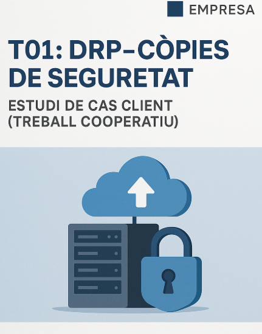

# Solució: T01: DRP: còpies de seguretat. Estudi cas client (treball cooperatiu)

Jhon Justiniano / SMX-B / Seguretat Informàtica / [Aquí teniu la solució en document google per si els és més comodo](https://docs.google.com/document/d/16gnri7U93clhJxhjhGq7WCiE4kr811vJx7-5Q0tpck8/edit?usp=sharing) / [Aquí teniu la solució en document pdf per si els és més comodo](https://drive.google.com/file/d/15Kqib50gFfcNwZY4yRdN0wPdNmrpOV1U/view?usp=sharing)

## Índex
- Introducció
- Presentació del cas client
- Infraestructura Tècnica
- Requisits de Recuperació
- Fase 1: Treball individual
- Fase 2: Treball per parelles
- Fase 3: Treball en grup
  - Document Final (Fase 3)

## Introducció

La primera hora el vostre responsable de seguretat us presenta el tema de les còpies de seguretat a partir d’un material didàctic. A continuació, caldrà que hi treballeu els aspectes del tema i ho fareu mitjançant una dinàmica cooperativa.

## Presentació del cas client

"Muntatges i Serveis Tècnics SL" és una petita empresa dedicada a la instal·lació i manteniment d'equips industrials.

## Infraestructura Tècnica

- Servidor de Fitxers (Ubuntu Server): Conté tota la documentació crítica:
  - Documents de Projectes: Plànols, especificacions tècniques (300 GB, creixement moderat).
    
  - Bases de Dades (Comptabilitat i Clients): Crítiques i d'ús diari (20 GB, canvi constant).
    
  - Carpetes Personals dels Usuaris: Per a la feina diària (100 GB).

- 10 Equips Clients (Windows 10/11):
  - Els usuaris treballen majoritàriament amb fitxers del servidor, però alguns tècnics guarden de forma temporal informes i altres arxius importants a la carpeta Documents.

- Connexió a Internet: Fibra òptica de 600 Mbps (simètrica).

## Requisits de Recuperació

- Temps de Recuperació (RTO): Les dades de Comptabilitat/Clients han d'estar disponibles en menys de 4 hores.

- Pèrdua de Dades Admesa (RPO): Es pot admetre una pèrdua màxima de 24 hores per a la majoria de dades, però les dades de Comptabilitat/Clients no poden perdre més de 4 hores de treball.

- Retenció: Cal guardar les dades amb un historial d'almenys un mes.

## Fase 1: Treball individual

De forma individual, heu de donar resposta a les següents preguntes basant-se en el cas pràctic:

**1.Què copiar? (Priorització): Quines són les dades més crítiques del servidor? Cal fer còpia dels 10 equips clients? Justifica-ho.**

- **Quines són les dades més crítiques del servidor?**
  - Base de dades (Compatibilitat i clientes): 20GB (canvi constant), crítiques, ús diari i canvi constant.
  - Documents de projectes: 300GB (creixement moderat), plans, especificacions tècniques.
  - Carpetes personals dels usuaris: 100GB i és d'ús diari per al treball.

- **Cal fer còpia dels 10 equips clients? Justifica-ho.**
  - No és estrictament necessari fer còpies de seguretat completa dels equips clients, ja que la majoria de les dades i les més importants es guarden i es troben en el servidor. A excepció dels informes temporals i dels arxius crítics que els tècnics guarden localment en documents, la solució seria fer una sincronització automàtica amb el servidor o una còpia diària d'aquests documents.
  - Justificació: El servidor és el que conté la informació crítica i la què és la més important del negoci. Els equips dels clients només té les dades temporals, és per això que la seva còpia pot ser una mica opcional o només limitada a les carpetes específiques que en aquest cas en documents.

**2.Periodicitat i Tipus de Còpia: Proposa un calendari bàsic per a la setmana (Diari/Setmanal/Mensual) i quin tipus de còpia aplicaràs (Completa, Diferencial, Incremental) per a les dades crítiques.**

- **Tipus de còpies:**
  - Completa: És per a tenir una base segura i s'usa més per a setmanal i mensual.
  - Incremental: És per a reduir el temps i l'espai s'usa més per a diàries.
  - Diferencial: És per a agilitzar les restauracions i s'usa més per a setmanals.

- **Base de dades (Compatibilitat i clients):**
  - Diària: Còpia incremental a cada 4 hores.
  - Setmanal: Còpia completa.
  - Mensual: Còpia completa per als arxius.

- **Documents de projectes i carpetes personals:**
  - Diària: Còpia incremental.
  - Setmanal: Còpia diferencial.
  - Mensual: Còpia completa.

**3.Mitjans i Ubicació: Quin tipus de mitjà de còpia utilitzaries (Discs durs externs, NAS, Cloud, Cintes)? On s'hauria de guardar físicament la còpia més recent (Regla 3-2-1).**

- **Mitjans recomanats:**
  - Nas intern: Per a còpies ràpides i per a restauració immediata.
  - Cloud: Per a còpies externes i segures.
  - Discos durs externs: Per a còpies mensuals fora de línia.
  - Cintes: Només si es busca un cost baix a un llarg temps, a llarg terme.

- **Ubicació segons regla 3-2-1:**
  - 3 còpies: original + dues còpies més.
  - 2 Tipus de mitjà: NAS + Cloud.
  - 1 còpia fos de l'empresa: En el núvol (Cloud).

“La còpia més recent ha d'estar en el *NAS intern per a una restauració ràpida.”

## Fase 2: Treball per parelles

Treballant per parelles:

**1.Discussió i Consens: Comparen les seves respostes individuals (Fase 1).**

Després de comparar les nostres parts individuals en la fase 1, vam arribat als següents punts que tenim en comú:

- Les dades més crítiques són les bases de dades, després vindran els documents dels projectes i finalment serien les carpetes personals.
- No fa falta copiar tots i completament els equips dels clients, només seria la carpeta de documents, això ja que tota la informació crítica està en el servidor, per tant, el més important seria el que està en el servidor.
- Tenim en comú la combinació de les còpies incrementals, les completes i les diferencials, però sempre prioritzant la seguretat diària, setmanal i mensual.
- Tenim en comú com utilitzarem NAS intern, discos externs i el Cloud, tot això respectant la regla 3-2-1.

**2.Elaboració d'una Proposta Unificada: Heu de consensuar i dissenyar el vostre propi Esquema 3-2-1 de Còpies (3 còpies, 2 mitjans, 1 fora de lloc) basat en els requisits del cas.**

| **Element**                              | **Proposta de la parella**                                                                                     | **Justificació**                                                                                                                                                                                                                     |
|------------------------------------------|----------------------------------------------------------------------------------------------------------------|--------------------------------------------------------------------------------------------------------------------------------------------------------------------------------------------------------------------------------------|
| **Dades crítiques**                     | - La base de dades de comptabilitat i dels clients (20 GB)   - Els documents dels projectes (300 GB)   - Les carpetes personals dels usuaris (100 GB)   - Carpetes de documents dels equips clients. | Són les dades més importants i més essencials perquè l'empresa funcioni correctament cada dia, ja que els projectes, les carpetes personals i les bases de dades són molt importants i imprescindibles per al treball dels treballadors de l'empresa i les dades dels clients només es copiaran de manera parcial per a evitar que es dupliquin. |
| **Periodicitat (bases de dades)**       | - Incremental cada 4 hores i seria de manera diària.   - Completa seria setmanal.   - Completa seria mensual també. | Les bases de dades és la informació que és la més sensible de l'empresa, a més necessita restauració ràpida i punts freqüents de la restauració.                                                                                   |
| **Tipus de còpia (Bases de dades)**     | - Diària - Incremental   - Setmanal - Completa   - Mensual - Completa                                      | Tindrem còpies freqüents, diàries, setmanals i mensuals. La còpia completa seria per a poder garantir la integritat setmanal i mensual.                                                                                            |
| **Mitjà 1 (Local)**                     | NAS intern per a les còpies diàries i setmanals.                                                                | Ens permetrà restauració ràpida i estaria sempre disponible en la xarxa interna.                                                                                                             |
| **Mitjà 2 (Extern)**                    | Disc dur extern per a còpies setmanals i mensuals fora de línia.                                                | Afegirem una capa de protecció.                                                                                                                                                                                                     |
| **Mitjà 3 (Fora de lloc)**              | Còpia en el Cloud, la qual cosa seria mensual. Una opció seria en el núvol.                                      | Compleix la regla del 3-2-1 i ens assegura que sí o sí una còpia està fora de la ubicació física.                                                                                                                                   |

## Fase 3: Treball en grup

**1.Debat i Selecció: Cada parella presenta el seu esquema. El grup debat els pros i contres de cada proposta (cost, temps de recuperació, seguretat, simplicitat).**

**2.Disseny de la Política Final: El grup ha de redactar la Política de Còpies de Seguretat Definitiva que presentaran a l'empresa "Muntatges i Serveis Tècnics SL".**

Després de debatre i posar-nos d'acord tots els presentem a continuació el document final.

### Document Final (Fase 3)

**El grup ha de generar un document amb els següents punts resolts:**

**1) Dades Objecte de Còpia**

**Quines dades es copien i amb quina freqüència (separant Servidor/Clients i crítiques/no crítiques).**

- Dades del servidor d'arxius Ubuntu Server

| Tipus de dades                                      | Volum                                | Criticitat         | Freqüència                                                                 |
|------------------------------------------------------|--------------------------------------|---------------------|----------------------------------------------------------------------------|
| **Documents de projectes (Plans, especificacions tècniques, etc.)** | 300 GB amb un creixement moderat    | Crític             | Diària: Incremental Setmanal: Completa Mensual: Completa            |
| **Base de dades (Compatibilitat i clients)**            | 20 GB però amb canvis constants     | Molt crític        | Cada 4 hores: Incremental Diària: Completa Setmanal: Completa Mensual: Completa |
| **Carpetes personals dels usuaris (Per al treball diari)** | 100 GB                              | Crític o mig crític | Diària: Incremental Setmanal: Completa                                 |

- Dades dels clients Windows 10/11
  - Només es realitzen les còpies de:

| Tipus de dades                     | Criticitat          | Freqüència                                  |
|------------------------------------|----------------------|---------------------------------------------|
| **Carpeta de Documents dels usuaris** | Crític o mig crític | Diària: Incremental Setmanal: Completa |

- Només fem còpies d'això i només diària i setmanal perquè els clients treballen directament amb dades que es troba en el servidor i només fa falta fer còpies de la carpeta de documents perquè alguns clients es guarden coses o arxius de manera temporal en la carpeta de documents.

**2) Cronograma Setmanal Detallat**

| Dia       | Dades                                      | Tipus de còpia                                                                 | Mitjà                                |
|-----------|-------------------------------------------|-------------------------------------------------------------------------------|--------------------------------------|
| **Dilluns**   | 1. Les bases de dades. 2. Els projectes i les carpetes. 3. Del personal i dels clients. | 1. Incrementals cada 4 hores + completa a les 23:00 h. 2. Incremental. 3. Incremental. | 1. NAS 2. NAS 3. NAS          |
| **Dimarts**   | 1. Les bases de dades. 2. Les altres dades. | 1. Incrementals cada 4 hores. 2. Incremental.                             | 1. NAS 2. NAS                    |
| **Dimecres**  | 1. Les bases de dades. 2. Les altres dades. | 1. Incrementals cada 4 hores. 2. Incrementals.                            | 1. NAS 2. NAS                    |
| **Dijous**    | 1. Les bases de dades. 2. Les altres dades. | 1. Incrementals cada 4 hores. 2. Incrementals.                            | 1. NAS 2. NAS                    |
| **Divendres** | 1. Les bases de dades. 2. Les altres dades. | 1. Incrementals cada 4 hores. 2. Incrementals.                            | 1. NAS 2. NAS                    |
| **Dissabte**  | 1. Les bases de dades. 2. Les altres dades. | 1. Completa setmanal. 2. Completa setmanal.                               | 1. NAS + Discs durs externs. 2. NAS + Discs durs externs |
| **Diumenge**  | 1. Les bases de dades. 2. Les altres dades. | Si és el primer diumenge del mes: còpies completes mensuals.                 | Cloud xifrades (còpies externes i segures) |

**3) Elecció de Mitjans i Ubicació (Regla 3-2-1)**

**Mitjà 1 (Local): Quin mitjà concret (p. ex., Disc dur USB, NAS) s'utilitza.**

NAS intern amb un RAID 5
- Estaria situat en el centre de processaments de dades de l'empresa.
- Estaria emmagatzemat totes les còpies incrementals com també les còpies completes setmanals.
- Tindria un accés ràpid per si fa falta fer restauracions ràpides.
- El RAID 5 és per si falla algun disc.

**Mitjà 2 (Extern): Quin mitjà (p. ex., Cloud, LTO) i el proveïdor proposat (p. ex., Azure, Google Cloud, servei local).**

Disc dur extern amb USB
- Estaria comentat només durant la realització de les còpies de seguretat setmanals i de les mensuals.
- Tindria una protecció per exemple contra les falles elèctriques, etc.
- Podem deixar-ho en una caixa forta dins del centre de processaments de dades o fora de l'empresa en algun lloc segur.

**Ubicació Fora de Lloc: On es guarda la còpia externa (física o lògica) i qui és el responsable de la seva gestió.**

Cloud i estaria pujat en el núvol
- Tindria una ubicació segura en el núvol.
- Tindria una còpia xifrada.
- El responsable seria el departament de IT de l'empresa i haurien de fer una validació mensual de la integritat.

**4) Estratègia de Recuperació (RTO/RPO)**

Primer que tot hem de deixar clar que el RPO no és el mateix que el RTO, el RPO és com un màxim de pèrdua de 4 hores i el RTO és la restauració completa en menys de 4 hores.

Per a garantir el compliment de la base de dades de comptabilitat i dels clients que compleixin amb el requisit RPO i RTO farem el següent:

**RPO = Màxim de 4 hores de pèrdua.**
Farem còpies de seguretat incrementals cada 4 hores de la base de dades i en cas d'un error sempre haurà d'haver-hi un punt de restauració menor a 4 hores.

**RTO = Restauració completa en menys de 4 hores.**
Les còpies haurien de guardar-se en el NAS intern i hauria de tenir accés directe i amplada de banda interna una mica elevada. A més una restauració de la base de dades de 20 GB des del NAS. També hauria d'haver-hi un sistema de restauració automatitzat.

**Alguns escenaris de recuperació:**
- Falla del servidor: Hauríem de fer una restauració des del NAS.
- Ransomware en el servidor: Si per algun cas no es pot usar el NAS hauríem de fer una restauració des de disc dur extern.
- Desastres físics: Hauríem de fer una restauració des del Cloud mensual que tardaria molt més o com les bases de dades tindran una còpia setmanal en el disc dur extern podríem fer la restauració des d'aquí.

[Aquí teniu la solució en document google per si els és més comodo](https://docs.google.com/document/d/16gnri7U93clhJxhjhGq7WCiE4kr811vJx7-5Q0tpck8/edit?usp=sharing)

[Aquí teniu la solució en document pdf per si els és més comodo](https://drive.google.com/file/d/15Kqib50gFfcNwZY4yRdN0wPdNmrpOV1U/view?usp=sharing)

[Torna a l'enunciat](README.md)

