# Solució Linux(Ubuntu): T02: DPR: còpies de seguretat. Cas pràctic

Primeramente para comenzar obviamente hay que crear la máquina.

Después añadimos un segundo disco, para eso nos vamos a la configuración de la máquina y al almacenamiento y añadimos un segundo disco.

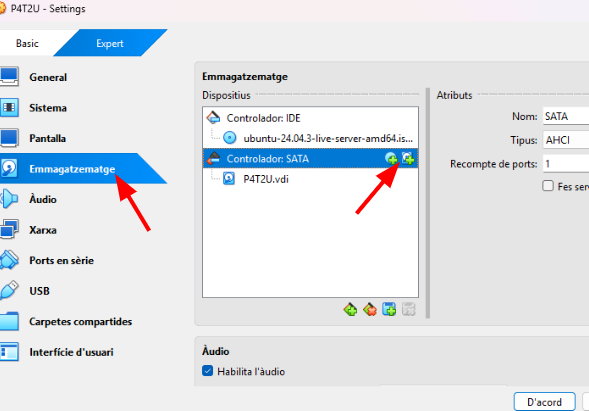

Le ponemos que es de 10 GB y le damos a finalizar.

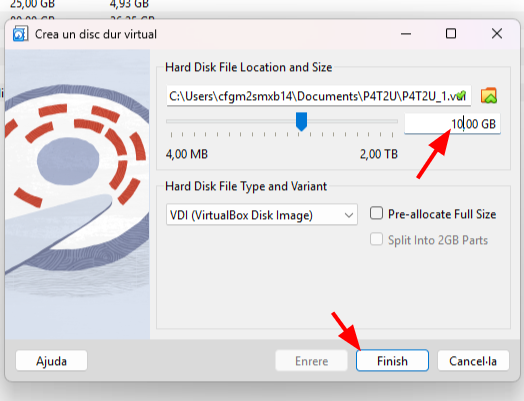

Y como podemos ver ya no sale creado. Ahora solo lo seleccionamos y le damos a “Choose”

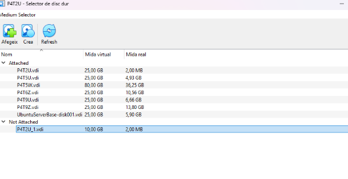

Y vemos como ya nos aparecerá en el almacenamiento de la máquina.

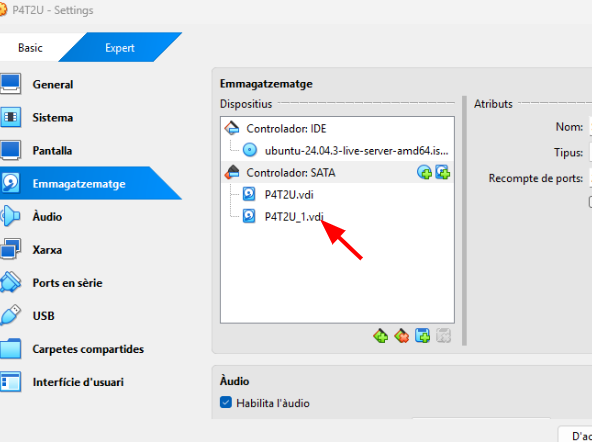

Ahora cuando iniciemos la máquina haciendo la comanda sudo fdisk -l vemos que nos aparece el disco que acabamos de añadir.

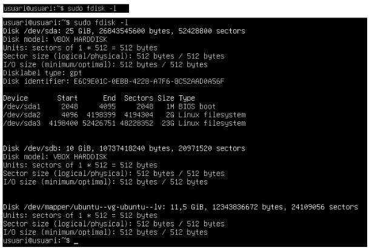

## Creación de la partición:

Antes de comenzar a hacer la actividad lo primero que tenemos que hacer es que tenemos que crear una partición del disco que anteriormente hemos añadido. Para eso hacemos la siguiente comanda que se muestra a continuación.

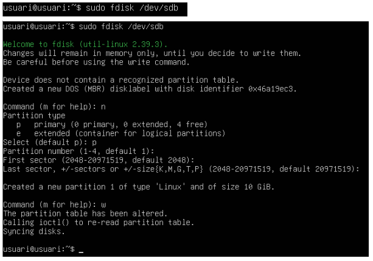

En la imagen anterior vemos que nos pedía algunos pasos, son los siguientes: n, p enter y por último w, con esto lo que hacemos es que creamos una nueva partición, le decimos que se asigne como partición primaria, y el enter es para que se haga con las cosas o los valores que ya vienen por defecto, por último la w es para que se guarden los cambios que hemos hecho.

Después nuevamente hacemos la comanda sudo fdisk -l. Y podemos ver que ya se ha creado correctamente la partición.

## Formato y montaje:

Tal y como nos pide la actividad ahora tenemos que darle o ponerlo en formato XFS, para eso tenemos que hacer la siguiente comanda.

El -f lo pongo porque anteriormente ya había entrado y si o si tengo que poner -f para poder volver a entrar y mostrar la captura.

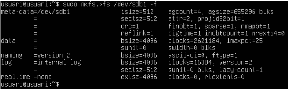

Después de que lo pusimos en formato XFS, lo siguiente que tenemos que hacer es crearle un punto de montaje, el cuál sea manual. Eso lo tenemos que hacer en la carpeta /medi/backup pero primero tenemos que crear  la carpeta.

Una vez creada la carpeta, ahora si lo montamos manualmente.

## Instalación del duplicity:

Para empezar a hacer la copias de seguridad, tenemos que instalar el Duplicity.

Y después también podemos ver la versión, no hace falta pero si les hace ilusión para que sepa que se puede ver la versión con la comanda que se muestra a continuación.

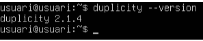

## Creación de los usuarios:

Tenemos que crear unos usuarios, pero ojo importante crear los usuarios con sus respectivas carpetas personales. Para eso hacemos las siguientes comandas una para cada usuario.

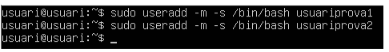

Después para asegurarnos que se ha creado bien hacemos las siguientes comandas con grep.

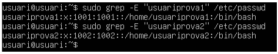

Ahora le ponemos contraseña a cada usuario. En mi caso les puse usuari a los los dos.

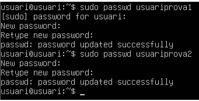

## Creación de los archivos de prueba:

Creamos unos cuantos archivos, cada uno de 10 GB.

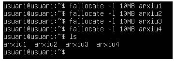

## Copia completa:

Ahora si que hacemos la copia de seguridad normal en la carpeta home. Hacemos la copia con la siguiente comanda.

Veremos que nos va a pedir una descripción, en mi caso le puse de descripción: copiat2linux

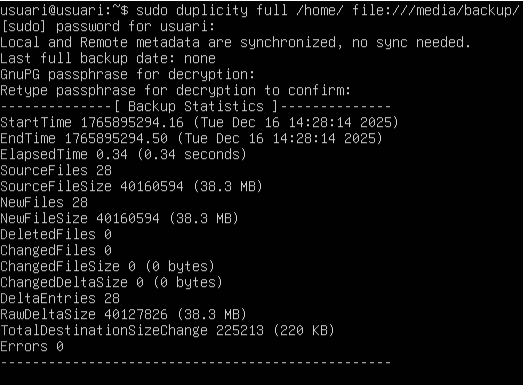

Ahora también para asegurarnos que las copias se seguridad se han hecho bien hacemos cd /media/backup para después hacer ls y si nos sale la copia de seguridad estará bien.

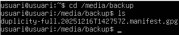

## Restauración de los datos:

Ahora sí tenemos que hacer la restauración, pero primero para hacer la restauración tenemos que borrar un archivo y después hacer la restauración. Para borrar el archivo hacemos la siguiente comanda.

Seguidamente hacemos la restauración, para eso hacemos la siguiente comanda.

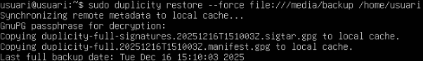

Y después para asegurarnos que se ha restaurado hacemos la comanda ls y efectivamente vemos que se nos ha restaurado el archivo 4 

## Copia Incremental:

Ahora añadimos un nuevo archivo, que este se va a llamar archivo 5

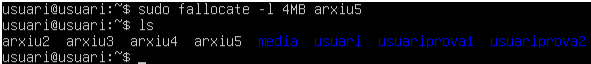

Una vez hecho el archivo, hacemos nuevamente la copia y como hemos añadido un nuevo archivo, el sistema detecta que hay un archivo más y ya hace la copia incremental. Vemos que no pedirá una descripción, yo de descripción puse: copiat2linuxincremental

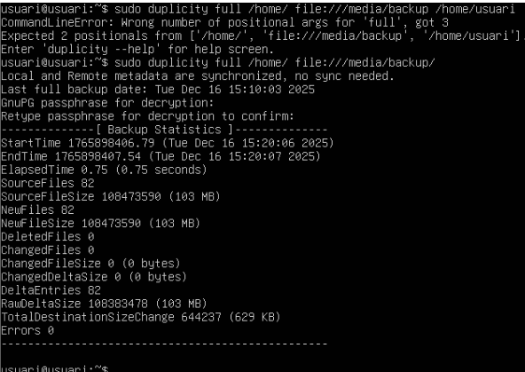

## Script de la copia automática:

Ahora para hacer el script, primero tenemos que desmontar la carpeta de backup, para eso hacemos la siguiente comanda.

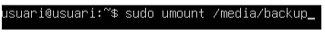

Ahora una vez desmontada la carpeta entramos al siguiente archivo.

Y creamos el script y le damos a guardar.

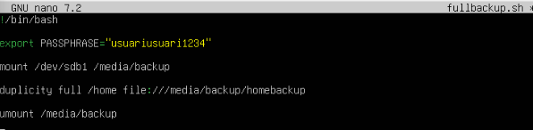

Después damos los permisos de ejecución

Ahora hacemos la comanda ls para ver que se ha creado bien y efectivamente si está.

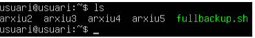

## Programación con el CRON:

Para programar el “CRON” hacemos la siguiente comanda y ponemos la opción 1

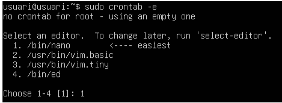

Una vez dentro añadimos la última línea que se muestra en la imagen, con esta última línea lo que hacemos es programar el “CRON” para que se ejecute cada domingo a las 11 de la noche.

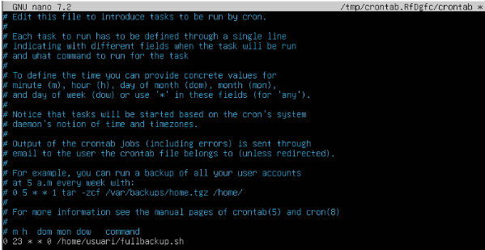

## Script de la copia automática incremental

Entramos al archivo “incrementalbackup.sh”. Entramos con el siguiente comando.

Una vez dentro creamos el SCRIPT

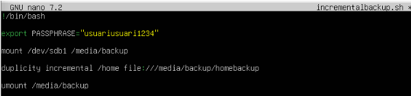

Después le damos los permisos de ejecución al igual que el anterior.

Y por último hacemos ls para ver que se ha creado bien y si efectivamente esta.

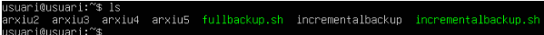

## Programación con el CRON:

Entramos al archivo con la siguiente comanda que ya anteriormente hemos entrado, entramos nuevamente con la siguiente comanda.

Una vez dentro añadimos la última línea para que se nos ejecute todos los días de lunes a sábado a las 11 de la noche.

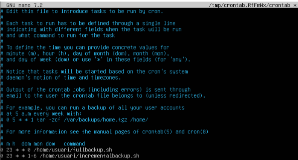

Isabel te pido disculpas por algunas capturas que se ven un poco borrosas, la verdad no se que paso es primera ves que me pasa, cuándo hacia capturas del la máquina virtual y lo ponia en el documento estaban bien, pero a medidad que fui redactando el texto de documentación se fueron poniendo borrosas. Te pido disculpas por algunas capturas que se ven borrosas.

[Torna a l'enunciat](README.md)
