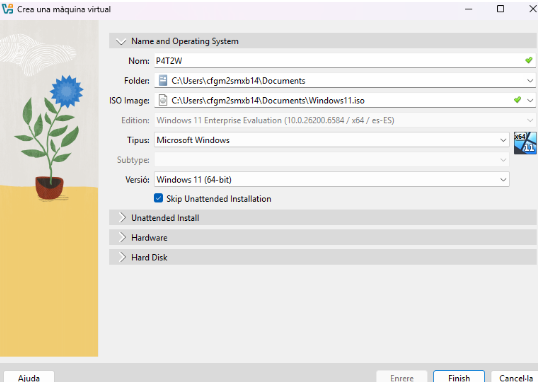
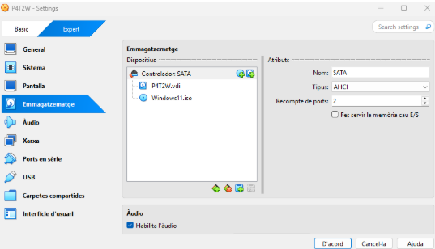
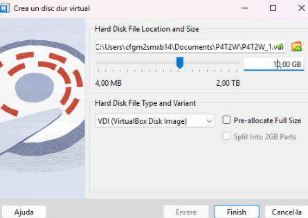
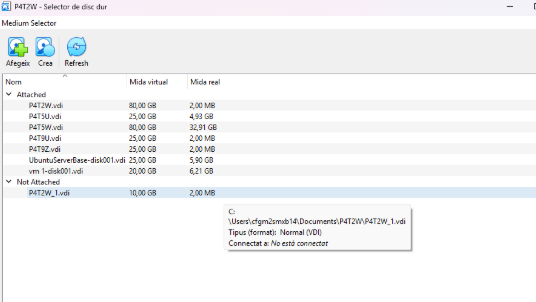
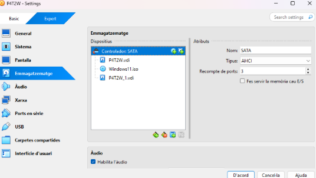
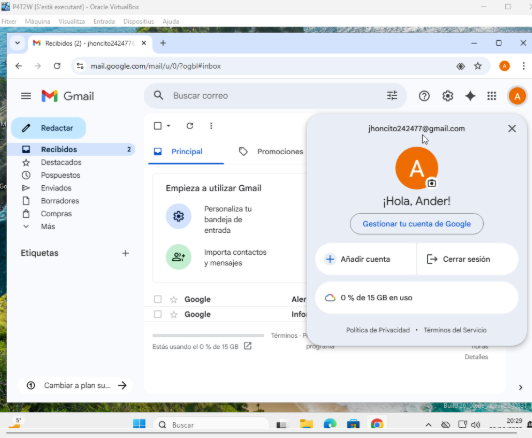
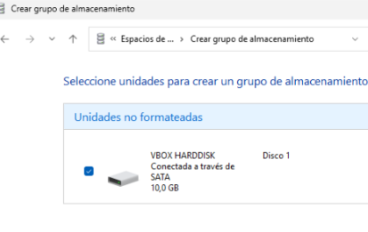
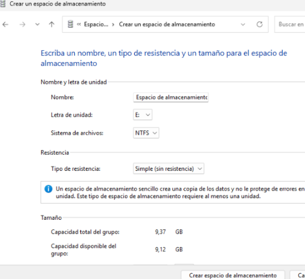
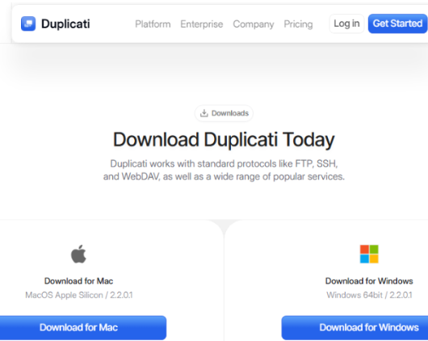
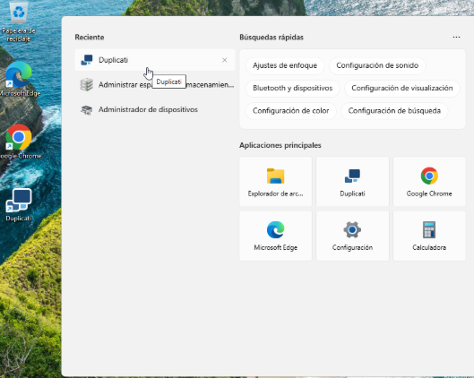

# Solució Windows: T02: DPR: còpies de seguretat. Cas pràctic

# Part 1: Còpia seguretat dels equips clients Windows

## Configuracions inicials

Primer que tot creguem la màquina Windows i li afegim el segon disc de 10 GB que ens demana la taverna.

Ens anem a emmagatzematge i afegir un disc, dins li donem a crear i posem que sigui de 10GB.

Com podem veure en la següent imatge ja tenim creat el segon disc ara el seleccionem i li donem a “choose”

I aquí en la imatge següent veiem com ja tenim posat el segon disc. Seguidament iniciem la màquina.

Una vegada iniciada la màquina iniciem sessió amb un correu que no sigui de l'escola per a fer la simulació, en el meu cas jo em creu un nou.

Després segueix configurar el segon disc, per a això ens administrarem espai d'emmagatzematge, creem el grup i creem l'espai d'emmagatzematge.

Seguidament, instal·lem el Duplicati i ho iniciem i seguim tots els passos d'instal·lació que ens demana, “només és donar-li següent-següent, instal·lar i posar una contrasenya”. La meva contrasenya és: usuario1234

## Creació de còpia de seguretat “LOCAL”

