# Solució Windows: T02: DPR: còpies de seguretat. Cas pràctic

# Part 1: Còpia seguretat dels equips clients Windows

## Configuracions inicials

Primer que tot creguem la màquina Windows i li afegim el segon disc de 10 GB que ens demana la taverna.

Ens anem a emmagatzematge i afegir un disc, dins li donem a crear i posem que sigui de 10GB.

Com podem veure en la següent imatge ja tenim creat el segon disc ara el seleccionem i li donem a “choose”

I aquí en la imatge següent veiem com ja tenim posat el segon disc. Seguidament iniciem la màquina.

Una vegada iniciada la màquina iniciem sessió amb un correu que no sigui de l'escola per a fer la simulació, en el meu cas jo em creu un nou.

Després segueix configurar el segon disc, per a això ens administrarem espai d'emmagatzematge, creem el grup i creem l'espai d'emmagatzematge.

Seguidament, instal·lem el Duplicati i ho iniciem i seguim tots els passos d'instal·lació que ens demana, “només és donar-li següent-següent, instal·lar i posar una contrasenya”. La meva contrasenya és: usuario1234

## Creació de còpia de seguretat “LOCAL”

Una vegada dins de l'aplicació per a crear la còpia de seguretat local li donem a Backups i add.

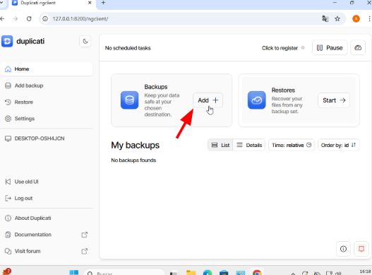

Seguidament li donem a add a new backup.

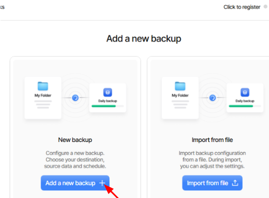

Després posem el nom de la còpia, la descripció que en el meu cas jo li vaig posar el mateix en el nom i en la descripció, i posem la contrasenya de la còpia que en el meu cas li vaig posar de contrasenya usuari.

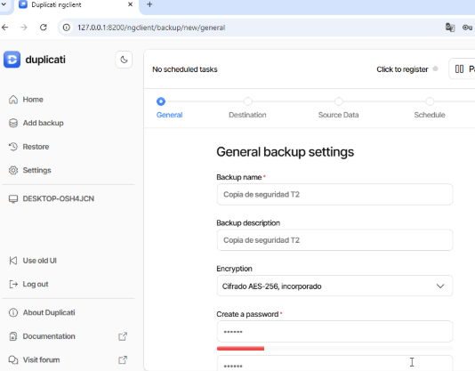

Cliquem en file system - Choose.

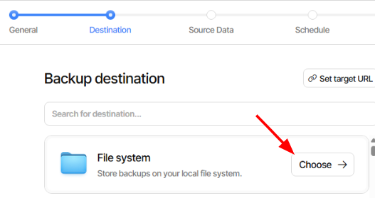

Després hem de posar el destí de la còpia que en el meu cas va ser en el disc secundari de 10 GB que van crear al principi.

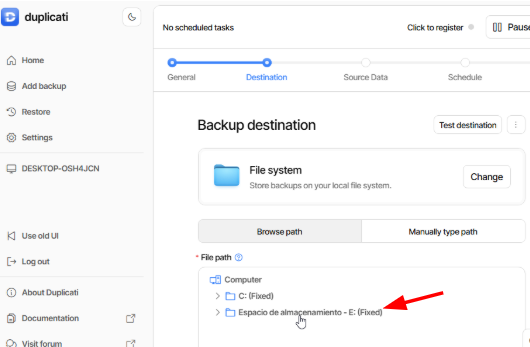

Seguidament seleccionem la carpeta que volem copiar que en el meu cas jo vaig posar documents.

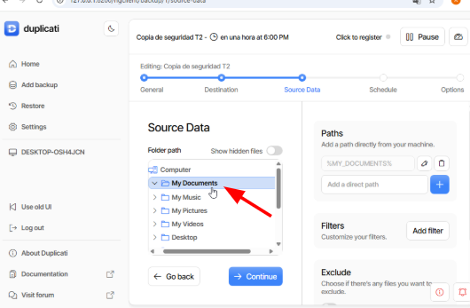

Seguidament hem de programar la còpia que en aquest cas és el que demana la tasca, a partir de les sis de la tarda del dia 9/12 es faran còpies de seguretat cada hora. després li donem a continuar.

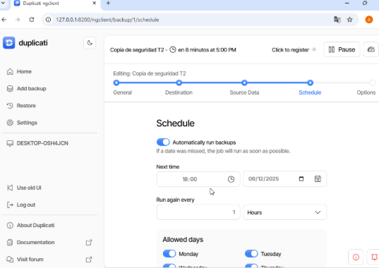

Després finalment posem que es guardin totes les versions.

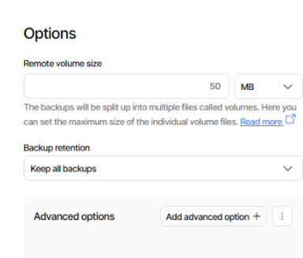

Podem veure com ja està completada i configurada la còpia.

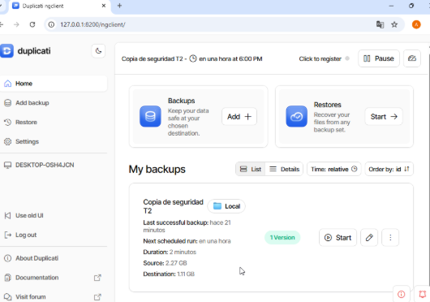

## Prova de la còpia “LOCAL”

Ens anem a documents i creem un arxiu o document i jo per exemple li vaig posar de nom “Prova t2”

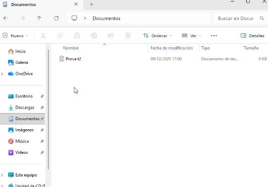

Una vegada creat l'arxiu o document tornem al Duplicati i en la còpia de seguretat del local li donem a start perquè es faci la còpia.

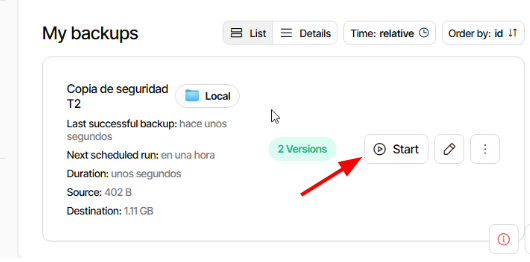

Ara si una vegada feta la còpia, esborrem l'arxiu o document de la carpeta de documents per a fer la prova de restauració.

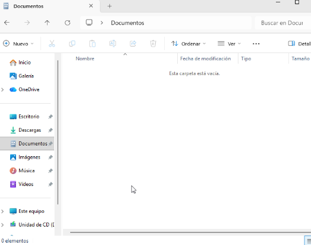

## Restauració de la còpia de seguretat “LOCAL”

Tornem novament al Duplicati i en “Restores” li donem a start.

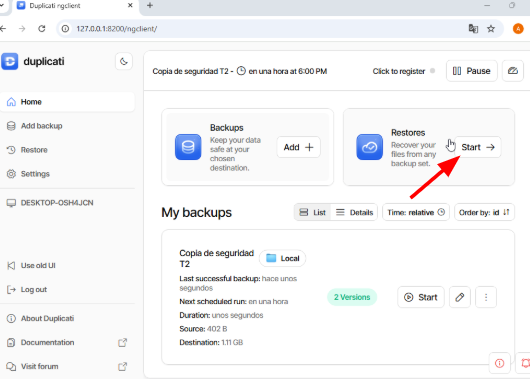

Després seleccionem la còpia que volem restaurar, ho seleccionem clicant sobre “Restore”

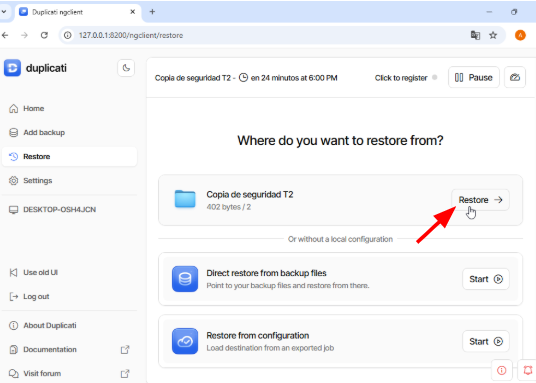

Després seleccionem el que volem recuperar, en el meu cas és el document Prova t2.

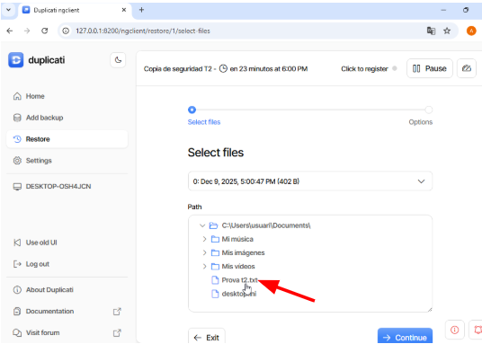

Li diem que ho volem restaurar a la ubicació original.

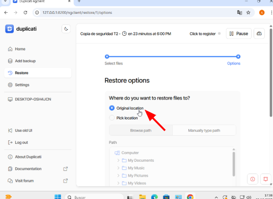

I finalment li donem a Submit.

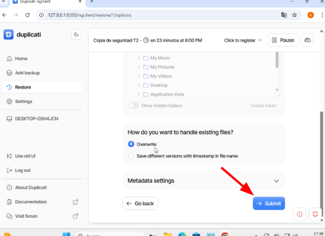

Ens diu que la restauració està completada.

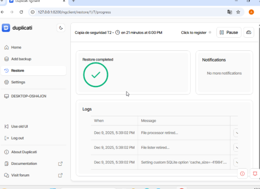

Per a comprovar que realment la restauració estigui completa i ben feta verifiquem en la carpeta de documents que estigui novament el document de “Prova t2” i efectivament si està.

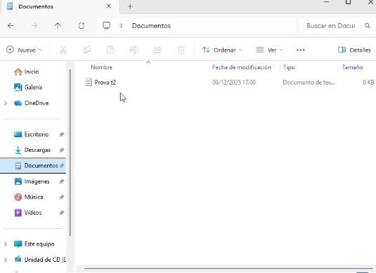

## Còpia de seguretat en “Google Drive”

Fem el mateix que abans, li donem a Backups i a add.

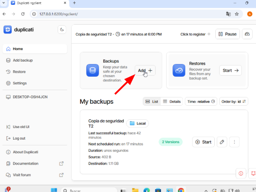

Li donem a Add new backup.

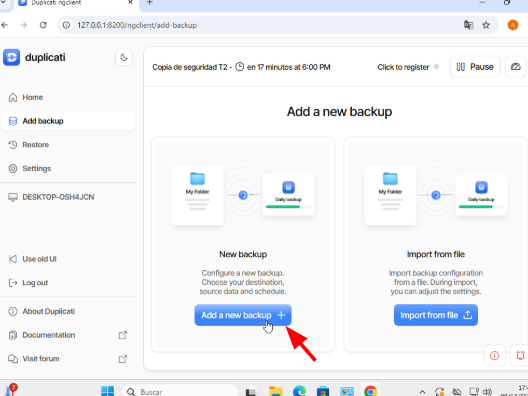

Li posem nom i descripció que en el meu cas he posat el mateix de nom que de descripció, també posem contrasenya de la còpia, en el meu cas de contrasenya vaig posar usuari1.

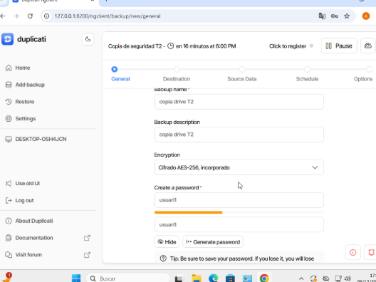

Ara si comencem a configurar la còpia, de destí li posem Google Drive i li donem a Choose.

Després posem la ruta de documents i hem de clicar sobre AuthID, això és per a vincular el nostre compte de Google.

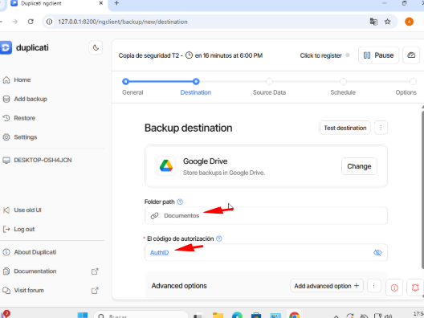

Quan fem clic sobre AuthID se'ns obrirà una finestra perquè vinculem el nostre compte de google on volem fer la còpia.

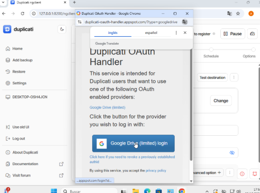

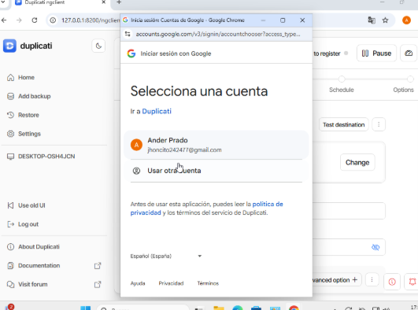

Una vegada que ja hem vinculat el nostre compte, de nou fem clic en AuthID per a obtenir el codi d'autorització per a poder continuar.

Si no tenim la carpeta documents Duplicati ens la crea.

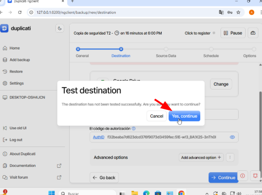

Després seleccionem que volem copiar, posem documents.

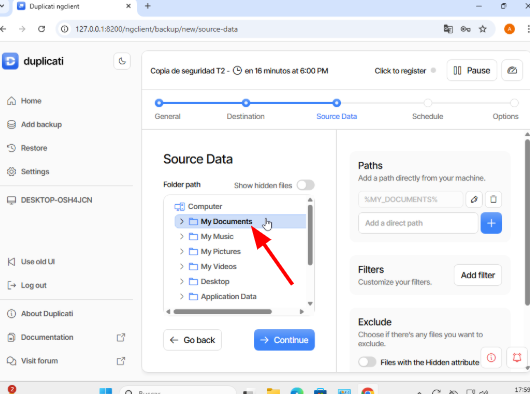

Ara programem l'hora i tot, ho fem d'acord amb el que ens demana la tasca, que serà que es faci la còpia de seguretat cada dia a les 18.00 de la tarda.

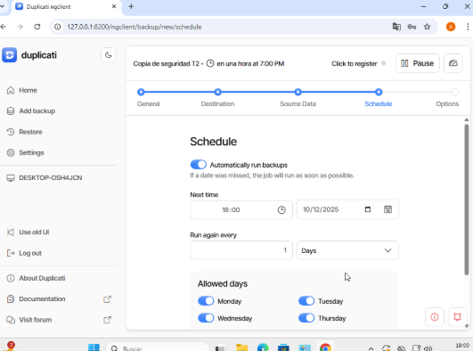

Li diem que mantingui totes les còpies, osigui deixem tot com està per defecte i li donem a continuar.

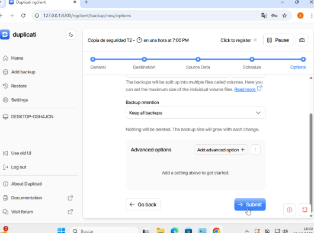

## Prova de la còpia “Google Drive”

Una vegada ja està creada i configurada la còpia li donem a start perquè faci la còpia de seguretat.

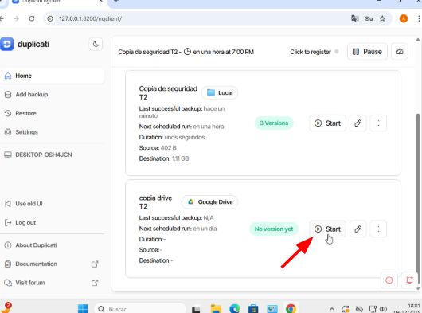

Com podem veure no em deixa fer la còpia de seguretat perquè crec que no hem vinculat bé el compte. Tranquils ara ho fem. Cliquem sobre la campaneta que ens surt a baix a la dreta i copiem el link que ens surt en el navegador de google.

Una vegada que copiem el link en un navegador google ens sortirà el següent a la qual cosa cliquem sobre el que posa Google Drive i triem el compte.

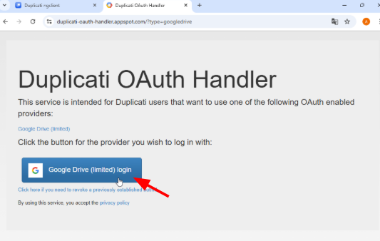

Després ens sortirà un codi el qual l'hem de copiar.

Una vegada tinguem el codi copiat tornem al Duplicati, li donem a editar la còpia de seguretat de Google Drive, i entrem a Destinació i on posa AuthID peguem el codi que havíem copiat abans i guardem.

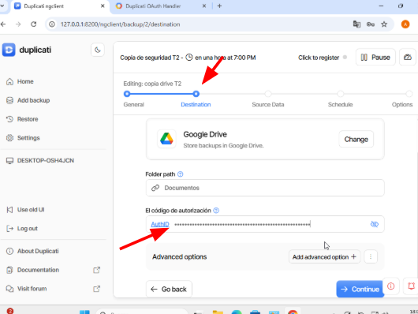

Una vegada ho hem guardat li donem a start a la còpia de seguretat de Google Drive.

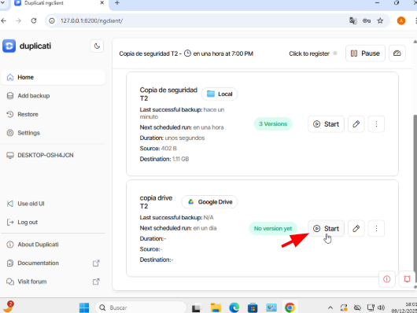

Com podem veure ara si que se'ns ha fet la còpia correctament perquè es va crear la carpeta documents en Google Drive amb tots els arxius de còpia.

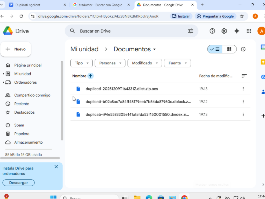

Ara abans de fer la prova de restauració esborrem el document de Prova t2 de la carpeta de documents.

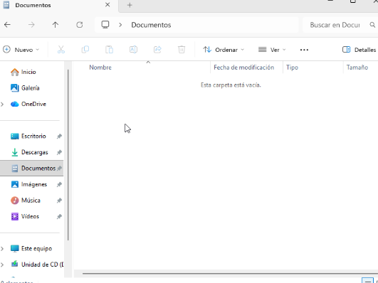

## Restauració de còpia de seguretat de “Google Drive”

Li donem a restore i start

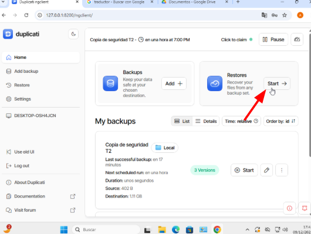

Després seleccionem la còpia de seguretat de Google Drive i li donem a restore.

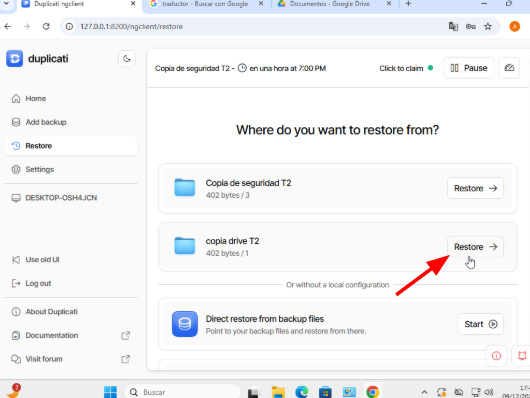

Després seleccionem el document de Prova t2 per a restaurar-lo i li donem a continuar.

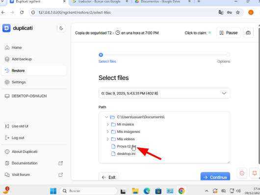

Li diem que volem que es restauri en la ubicació original.

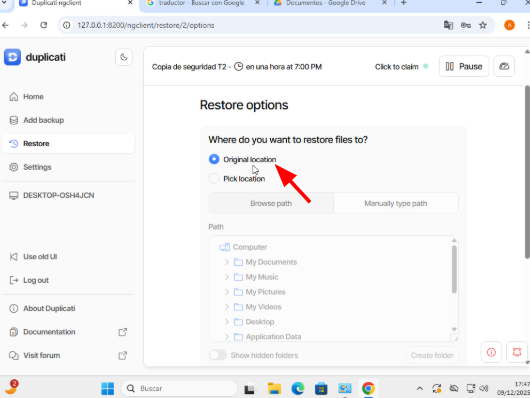

Li donem a submit i ja estaria.

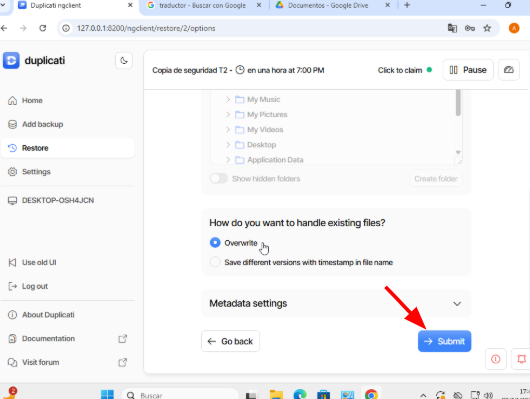

Com podem veure ens diu que la restauració s'ha realitzat correctament.

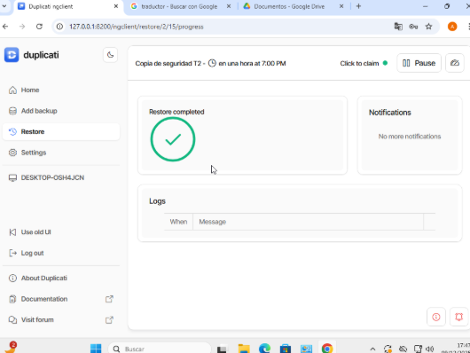

Per a comprovar-ho ens anem a la carpeta documento i hauria d'estar en document de Prova t2 i efectivament sí que hi hes.

[Torna a l'enunciat](README.md)

