# Solució: T05: Accés Remot. Connexió via SSH (tasca individual)

Primero que todo desde la máquina de ubuntu cambiamos la interficie de red a red NAT:

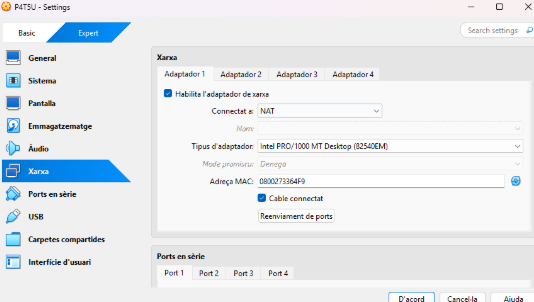

La segunda ponemos en sólo anfitrión:

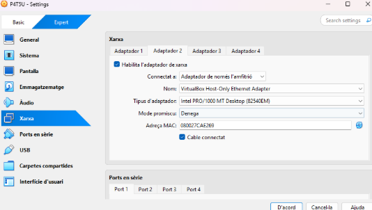

La máquina windows 11 también tiene que estar en red NAT y en solo anfitrión:

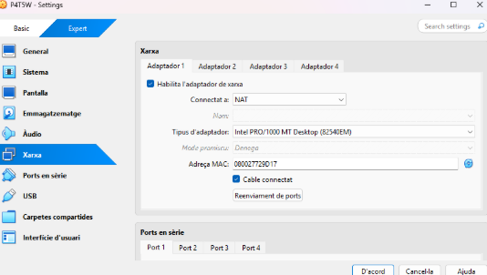

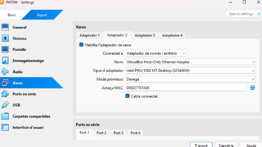

Después entramos al netplan y editamos, ponemos las dos interficies en "true":

``` bash
sudo nano /etc/netplan/50-cloud-init.yaml
```

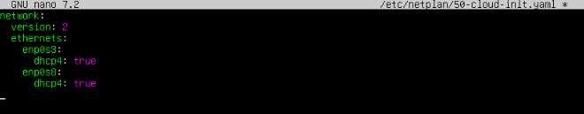

Después aplicamos los cambios:

``` bash
sudo netplan apply
```

**Ahora si podemos comenzar con las actividades.**

### Instala el servicio ssh en el Ubuntu 

Instalamos el servicio ssh desde ubuntu:

``` bash
sudo apt install ssh
```

habilitamos el servicio ssh:

``` bash
sudo systemctl enable ssh 
```

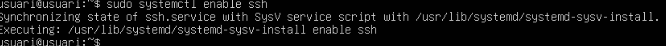

Miramos que el servicio ssh esté activo:

``` bash
sudo systemctl status ssh 
```


### Documenta la primera conexión dónde pregunta por la validez del certififcado

Hacemos ip a en la máquina Ubuntu para ver la ip del adaptador de solo anfitrión:

``` bash
ip a
```

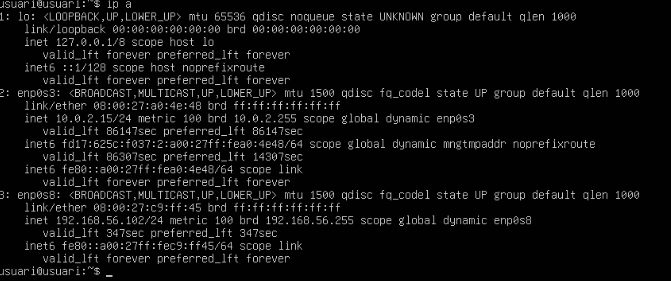

Ahora si desde la máquina Windows en powershell o terminal comprobamos la conexión haciendo ssh + nombre de la máquina Ubuntu + ip de solo anfitrión de la máquina Ubuntu .Nos pedirá permisos, osea la contraseña y unos cuántos “yes”

``` bash
ssh usuari@192.168.56.102
```

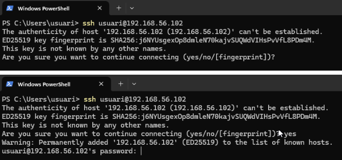

Después de poner la contraseña ya nos conectaremos remotamente via ssh

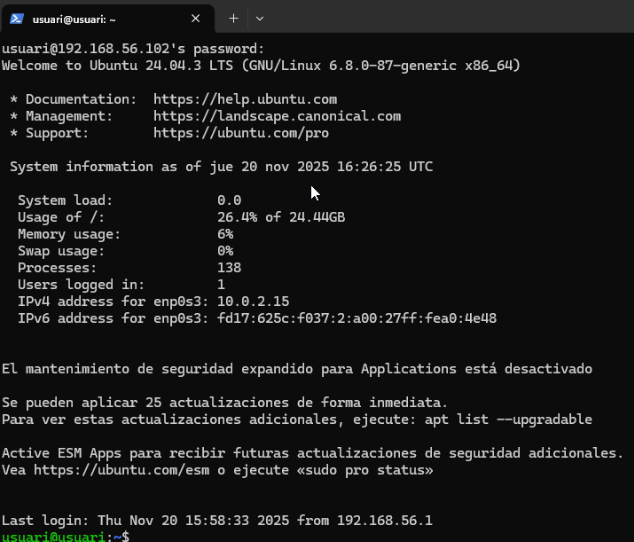

Para ver el nombre y asegurarnos que es esa la máquina Ubuntu a la que nos qeriamos conectarnos hacemos un hostname y nos tendria que salir el nombre de nuestra máquina Windows en mi caso se llama "usuari"

``` bash
hostname
```

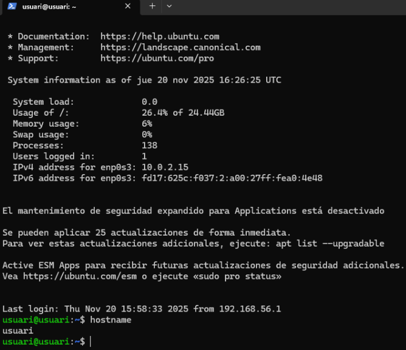

### Habilita el usuario root en Ubuntu (Se hace poniendole una sontraseña)

Ahora habilitamos el usuario root y lo hacemos poniendo una contraseña. Hacemos sudo passwd root y nos pedirá la contraseña y le asignaremos una contraseña la cuál le he puesto “usuari”

``` bash
sudo passwd root
```

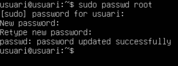

### Muestra la configuración relativa a los usuarios en el archivo sshd_config: Habilita solo un usuario para poder acceder remotamente y que los otros usuarios no puedan conertarse.

Desde la máquina Ubuntu entramos al siguiente archivo:

``` bash
sudo nano /etc/ssh/sshd_config
```

Dentro del archivo añadimos la última línea que se muestra a continuación:

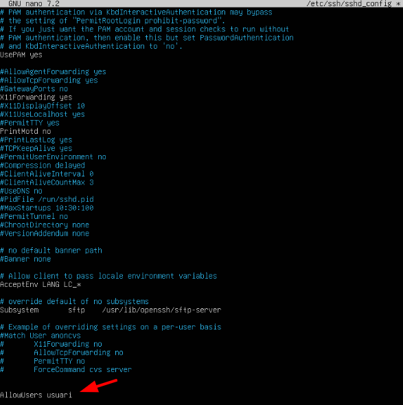

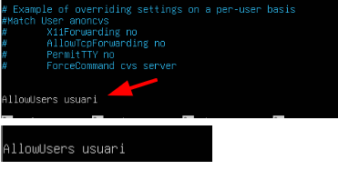

### Comprueba cómo el usuario root si puede hacer login en local pero no puede inicar sesión remota vía ssh

Desde la máquina Ubuntu hacemos login de manera local con el usuario root:

``` bash
su - root
```

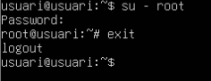

Después desde la máquina Windows intentaremos hacer ssh con el usuario root y veremos qué nos dice que el acceso es denegado. Se hace poniendo ssh + el nombre de usuario que en este caso el root + la ip de la máquina Ubuntu

``` bash
ssh root@192.168.56.102
```

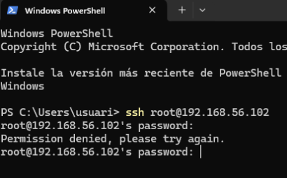

### Documenta y configura ssh para acceder con certificado cliente en lugar de usuario y contraseña

En la máquina Windows generamos algunos códigos RSA con la comanda siguiente: 

``` bash
ssh-keygen -t rsa
```

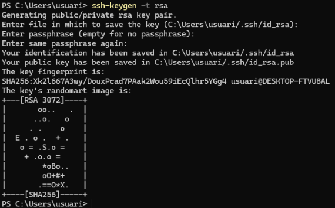

Ahora lo que vamos hacer es mirar que tengamos los archivos anteriores que necesitamos, lo cuál tenemos que copiar en nuestra máquina Ubuntu es el que acaba en .pub y lo vamos a copiar con la comanda scp

``` bash
ls .\.ssh\
```

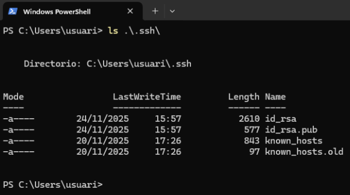

Con la comanda scp lo copiamos a la máquina Ubuntu:

``` bash
scp .\.ssh\id_rsa.pub usuari@192.168.56.102:/home/usuari
```

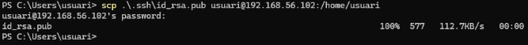

En nuestra máquina ubuntu creamos el siguiente archivo, tiene que estar dentro de la carpeta ssh. Lo creamos con la siguiente comanda:

``` bash
touch .ssh/authorized_keys
```

Ahora copiamos la clave id_rsa.pub dentro del archivo que creamos en la comanda anterior.


``` bash
cat id_rsa.pub >> .ssh/authorized_keys
```

Ahora desde la máquina Windows hacemos ssh + nombre de la máquina Ubuntu en mi caso es usuari + ip para comprobar que podemos conectarnos a la máquina ubuntu sin que nos pida la contraseña.

``` bash
ssh usuari@192.168.56.102
```


### Configura en el equipo Windows 11 el servidor OpenSSH

Entramos a la configuración de Windows 11 y entramos a sistemas.

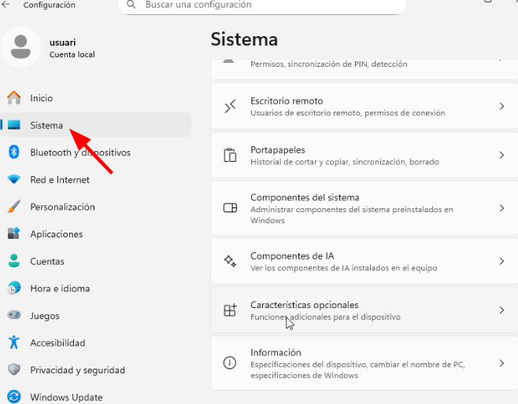

Dentro de sistemas tenemos que entrar a “ver características” y permitimos que la aplicación haga cambios en el dispositivo.

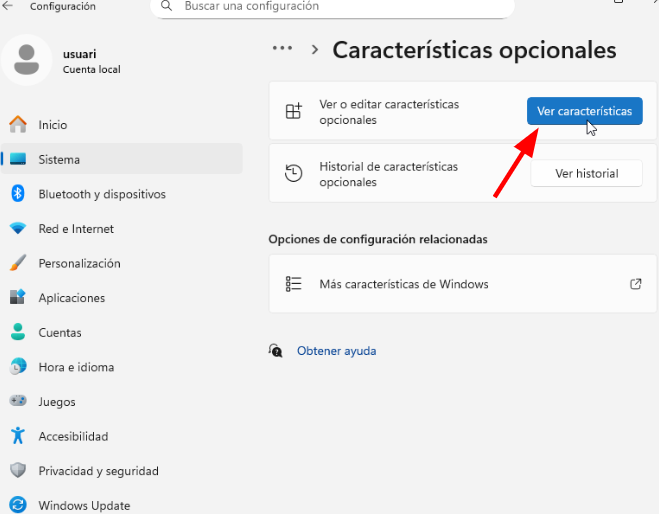

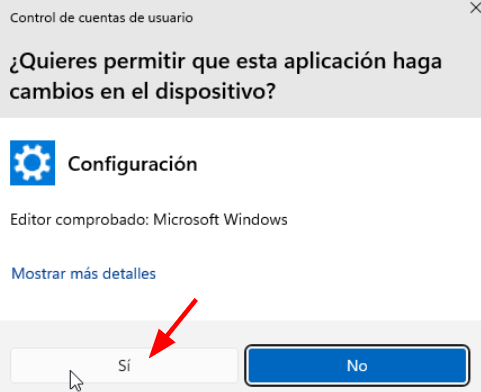

Una vez dentro de la aplicación, IMPORTANTE darle a “ver las características disponible”

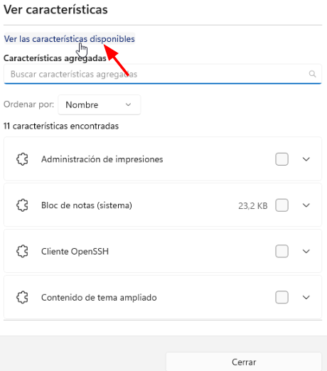

Buscamos “OpenSSH”, marcamos la casilla y le damos a agregar.

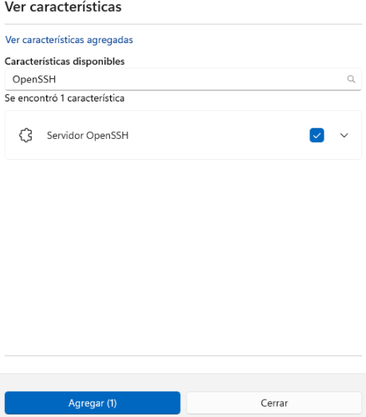

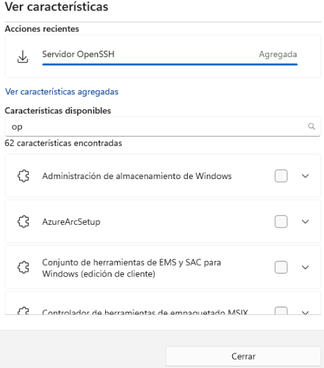

Una vez agregado seguimos con el siguiente punto

### Conectate remotamente desde el equipo linux (en mi caso es Ubuntu)

Para poder conectarnos remotamente primero tenemos que hacer lo siguiente:

- Primero apagamos el Firewall en windows 11, buscamos “Firewall y protección de red” entramos y seguidamente entramos a “Red pública” y la desactivamos.

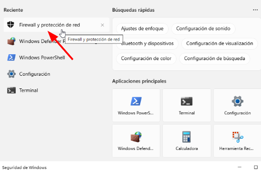

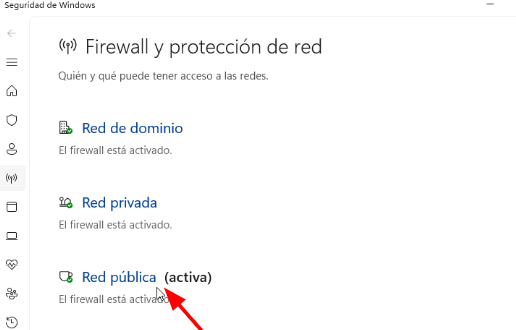

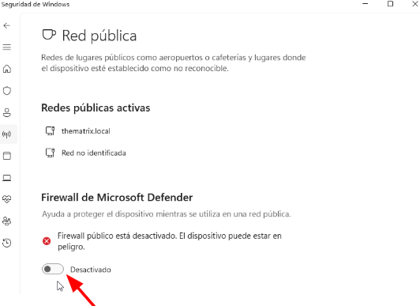

- Seguidamente ejecutamos el powershell como administrador 

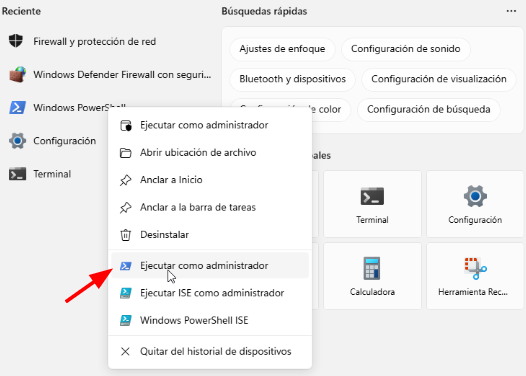

- Una vez iniciado el powershell como administrador encendemos en servicio de server SSH

``` bash
Start-Service ssh
```

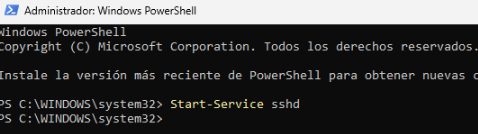

- Hacemos que cada vez que iniciemos la máquina se active el servicio.

``` bash
Set-Service -Name sshd -StartupType "Automatic"
```

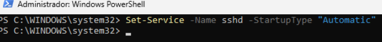

- Por último hacemos ipconfig desde el powershell de la máquina Windows para ver la ip del adaptador de solo anfitrión y que después con esa ip nos conectaremos desde la máquina Ubuntu.

``` bash
ipconfig
```

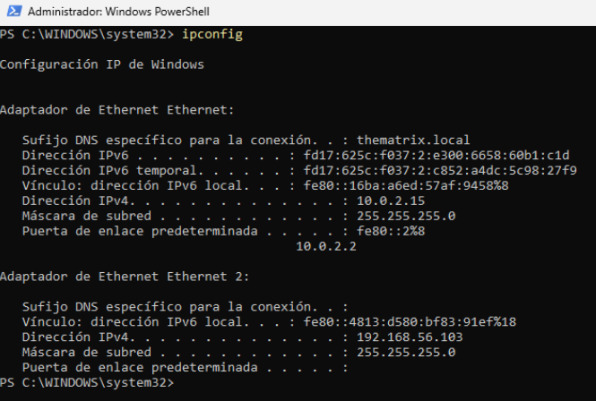

**Ahora si que hacemos el ejercicio que es conectarnos remotamente desde la máquina Linux que en mi caso es Ubuntu**

Desde la máquina Ubuntu nos conectamos a la máquina Windows con la ip de la interfície de solo anfitrión de la máquina Windows

- Primero hacemos un ping desde la máquina Ubuntu para comprobar que se pueden ver entre las dos máquinas. El ping sería ping + ip de solo anfitrión de la máquina Windows.

``` bash
ping 192.168.56.103
```

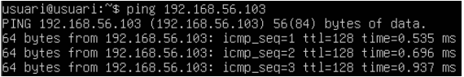

- Una vez comprobado que las dos máquinas se ven ahora si que nos conectamos desde la máquina Ubuntu a la máquina Windows. Lo vamos hacer haciendo ssh + el nombre de la máquina windows + la ip de solo anfitrión.

``` bash
ssh usuari@192.168.56.103
```

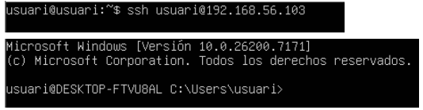

### Crea un túnel ssh (Proxy SOCKES) como el de la guía

Desde la máquina Windows ejecutamos la siguiente comanda para crear el túnel

``` bash
ssh -D 9876 usuari@192.168.56.102 
```

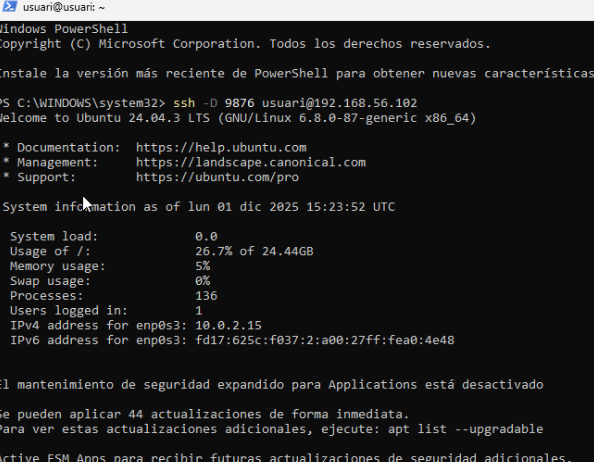

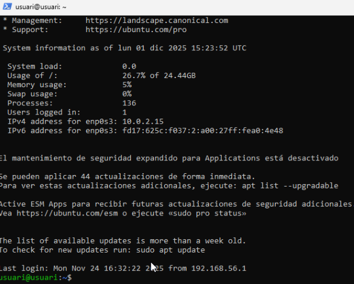

**Configuración del túnel Proxy en windows:**

Abrimos el panel de control - red y internet - opciones de internet - Conexiones - Configuración LAN

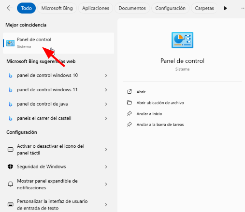

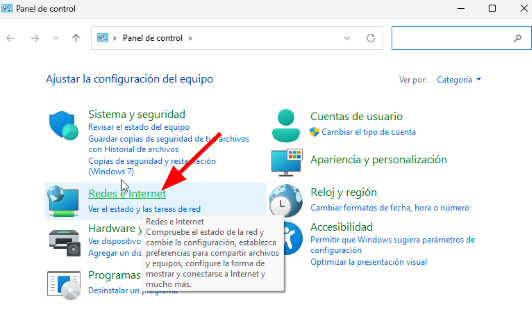

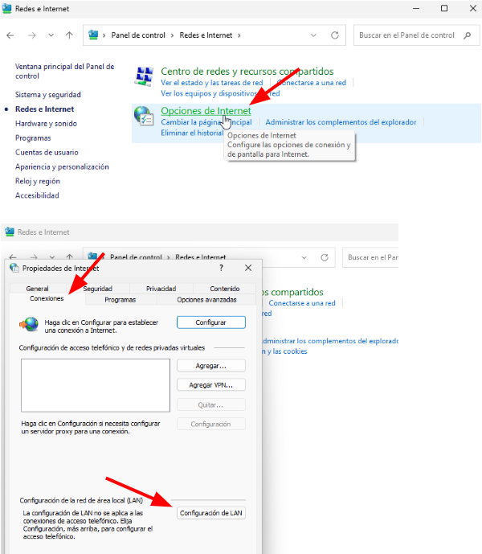

Después habilitamos el servidor Proxy con la IP local de la máquina Ubuntu y puerto 9876

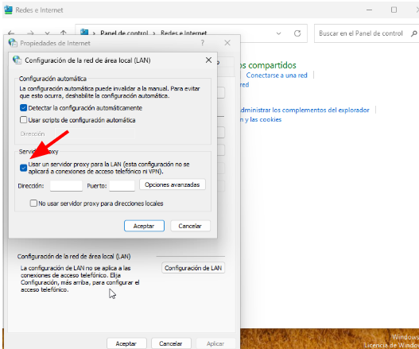

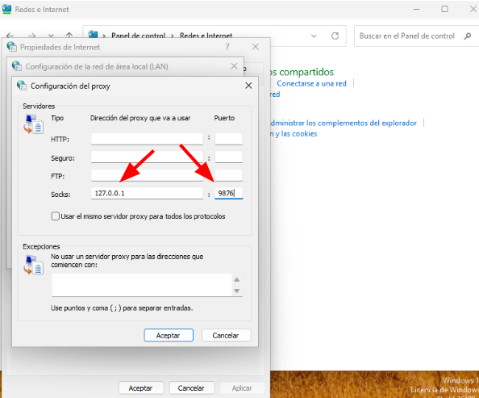

Por último hacemos la validación del túnel con wireshark. Para eso nos descargamos wireshark si es que no lo tenemos descargado

Abrimos wireshark y ya nos tendría que salir:

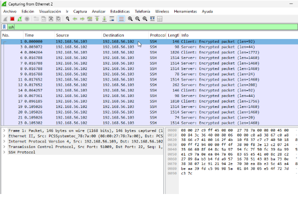


