# Solució: T06: Accés remot. Escriptori remot (RDP) (tasca individual)

## Máquina Windows:

Lo primero que tenemos que hacer es poner la máquina Windows en el adaptador de “Red NAT” para que se puedan ver y al mismo tiempo tengan conexión a internet .

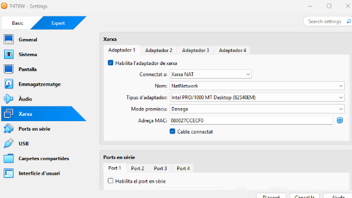

## Máquina Zorin:

Lo mismo ponemos la máquina Zorin en adaptador de “Red NAT” para que se pueda ver con la máquina de Windows y que al mismo tiempo tenga conexión a internet.

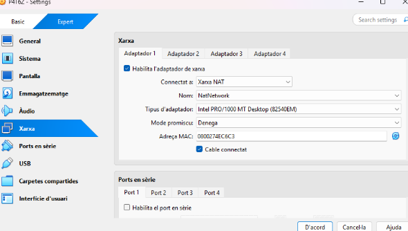

## Configuración de la Máquina Windows:

Una vez iniciada la máquina, nos vamos a la configuración y entramos a sistemas y a escritorio remoto, y obviamente activamos la opción de escritorio remoto. Esto es para que otra máquina en este caso en Zorin se pueda conectar remotamente.

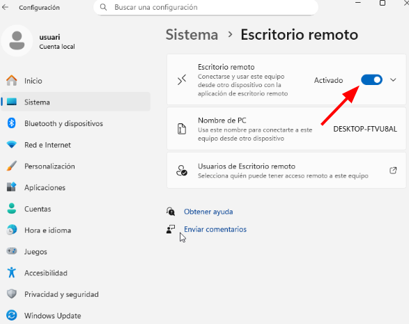

Ahora entramos a “Usuarios de Escritorio Remoto” para decirle a la máquina que usuario tendrá el permiso para conectarse remotamente.

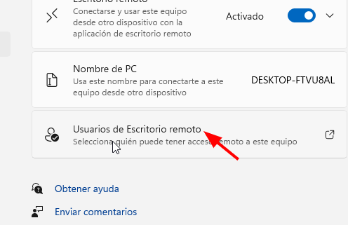

Una vez dentro le damos a agregar.

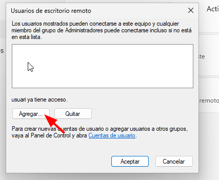

Aquí tenemos que poner lo mismo que sale en el apartado: Desde esta ubicación. Ponemos eso donde dice “Escriba los nombres de objeto que desea seleccionar”, ponemos eso y una barra y el nombre del usuario de la máquina Windows. En mi caso será /usuari y por último le damos a aceptar.

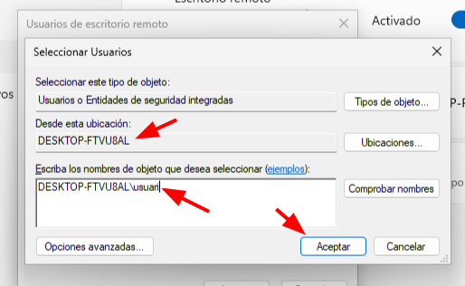

Cómo podemos ver ya estaría, le damos a aceptar.

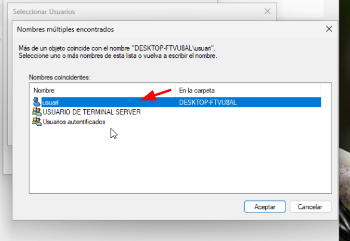

Y ya nos sale en los usuarios de escritorio remoto, vemos que es el mismo y le damos a aceptar.

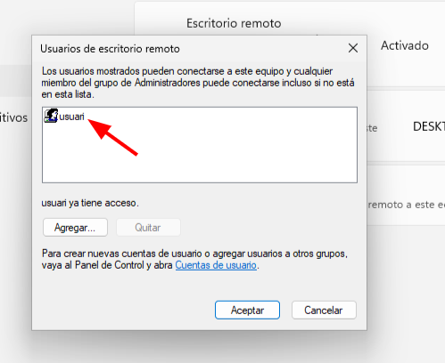

Después también desactivamos el firewall. Nos vamos a la configuración del sistema y entramos a “Privacidad y seguridad” y entramos a “Firewall y protección de red”.

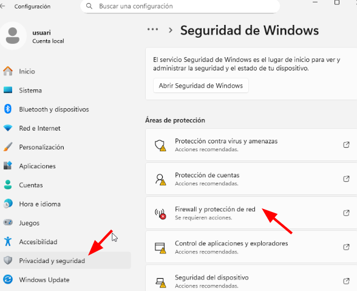

Y desactivamos todo.

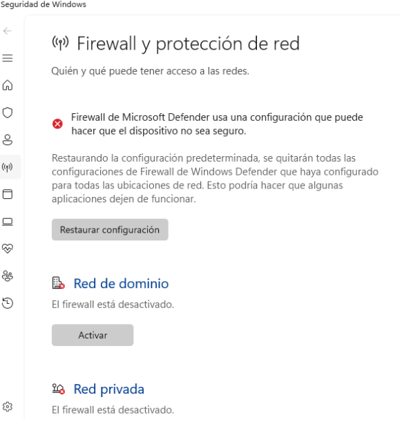

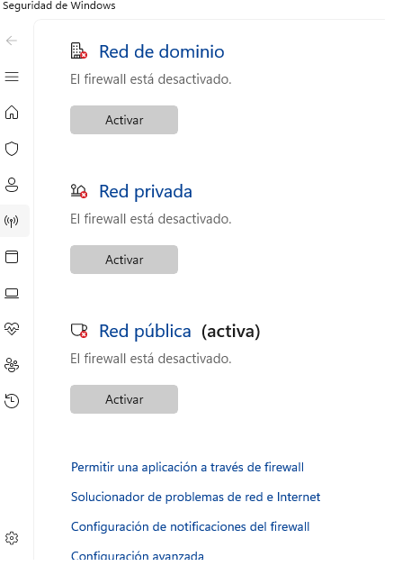

## Configuración de la máquina Zorin:

Una vez iniciada la máquina, nos vamos a la configuración de la máquina y entramos a sistemas y a escritorio remoto.

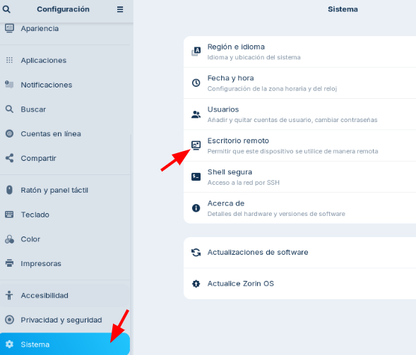

Y activamos las dos opciones, compartición de escritorio y control remoto.
Como podemos ver nos sale el nombre del equipo, el puerto, el nombre del usuario y la contraseña.

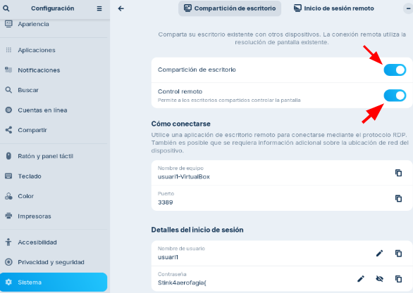

## Conexión desde Zorin a Windows:

Desde la máquina de Windows abrimos la terminal y hacemos ipconfig para ver la ip y poder conectarnos desde la máquina Zorin.

``` bash
ipconfig
```

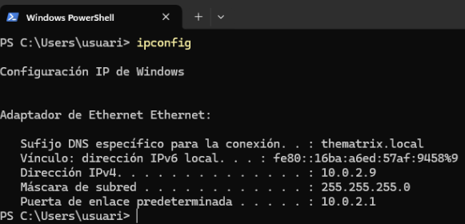

Después entramos a la aplicación Remmina para conectarnos.


Una vez dentro ponemos la ip que nos dio la máquina Windows.


Nos pedirá certificación a lo cuál le damos que si queremos aceptar el certificado.

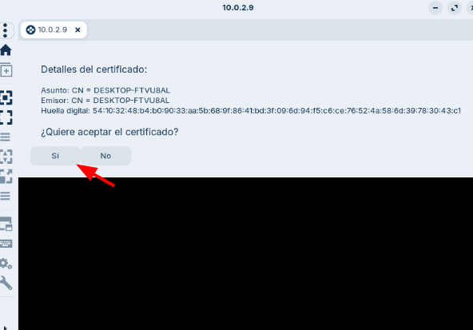

Nos pedirá que pongamos el nombre de usuario y contraseña de la máquina Windows y le damos a aceptar.

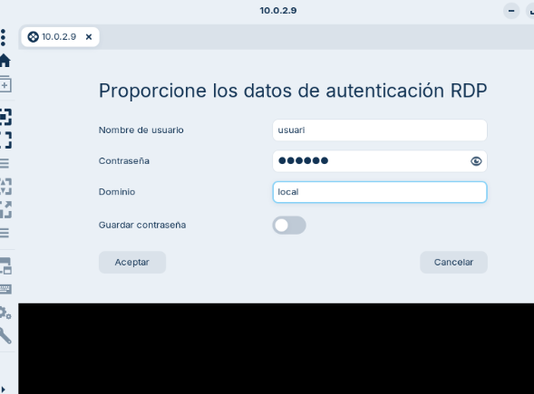

Después de hacer la validación y eso ya nos hemos conectado y como podemos ver nos aparece la pantalla de la máquina Windows dentro de la máquina Zorin.

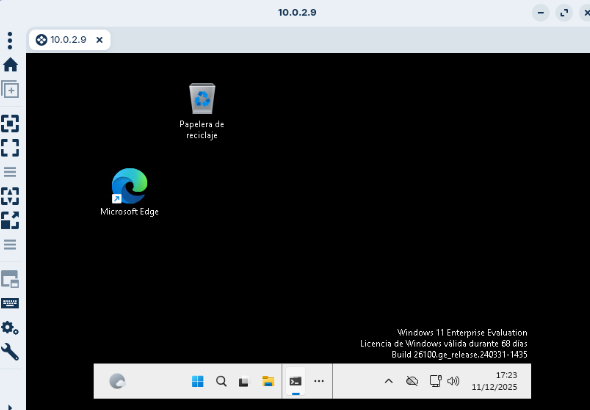

## Conexión desde Windows a Zorin:

Lo mismo desde la máquina Zorin hacemos ip a para ver la ip de la máquina y poder conectarnos desde la máquina Windows.

``` bash
ip a
```

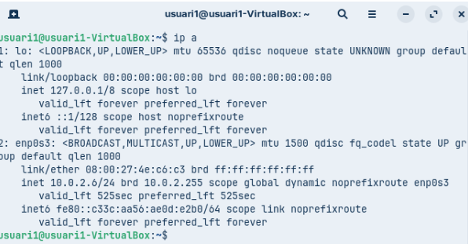

Ahora abrimos la aplicación de “Conexión a Escritorio remoto”

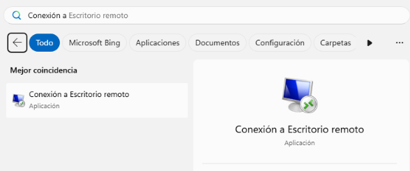

Una vez dentro de la aplicación, ponemos la ip de la máquina Zorin y le damos a aceptar.

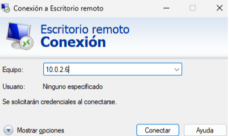

Seguidamente nos pedirá el nombre de usuario y la contraseña, en este caso no es el usuario de la máquina ni la contraseña del usuario. En este caso para poner el usuario y la contraseña no vamos a configuraciones y a sistemas y dentro entramos a escritorio remoto.

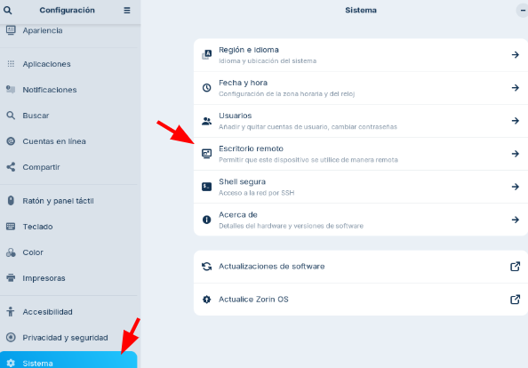

Y el usuario que tenemos que poner y la contraseña es la siguiente:

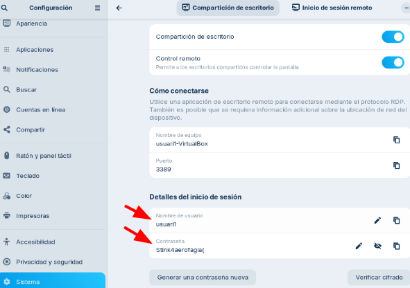

Ahora si ponemos el nombre de usuario y la contraseña que he indicado antes.

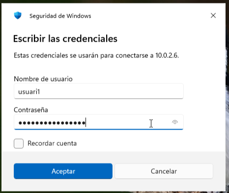

Igualmente nos sale la certificación y le damos que si.

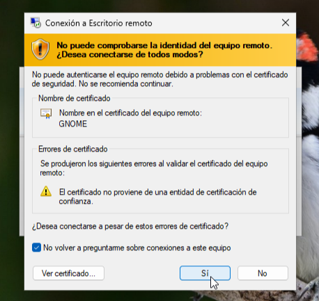

Y como podemos ver ya nos hemos conectado desde la máquina Windows a la máquina Zorin.

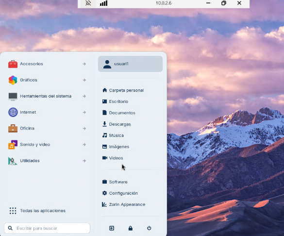


[Torna a l'enunciat](README.md)
