# Solucó-Client: T07: Accés remot. Serveis d’assistència remota (tasca en parelles)

## Fase 1: Anàlisi Comparativa i Selecció de la Solució

Lo primero que tenemos que hacer es hacer la tabla y decidir qué herramientas utilizaremos.

### Tabla comparativa.

| **Criterio**                                      | **TeamViewer**                                                                                                      | **AnyDesk**                                   | **Chrome Remote Desktop**                                      | **LogMein**                                      |
|---------------------------------------------------|----------------------------------------------------------------------------------------------------------------------|-----------------------------------------------|-----------------------------------------------------------------|---------------------------------------------------|
| **Facilidad de uso para el cliente**             | Tenemos que descargar la aplicación o también si es caso de cliente sería el módulo QuickSupport y también el usuario tendrá que darle la contraseña y el ID al técnico. | Tienen que instalarlo, tiene ID fácil.       | Es fácil de utilizar si es que el cliente tiene una cuenta de Google que yo creo que todos tienen. | Se tiene que descargar una aplicación.           |
| **Instalación / Portable**                       | Como he dicho antes tiene la opción de QuickSupport                                                                 | Tiene una instalación rápida                 | No hace falta tenerlo instalado en el escritorio del ordenador | Tienen que tener una instalación                 |
| **Windows, macOS, Linux, dispositivos móviles**  | Sí tiene todo                                                                                                       | Sí tiene todo                                | Sí tiene todo                                                    | Tiene todo menos Linux                           |
| **¿Permite una versión gratuita para uso comercial?** | No permite                                                                                                           | No permite                                   | Sí que permite                                                   | No permite                                       |
| **Precio**                                       | El técnico sí que tiene que pagar algo o si no alguna suscripción                                                   | Tienen que tener algún pago pero es un poco más barato | Si es de Google claro que es gratis                                | Se necesita un pago que la verdad que es un poco caro |
| **¿En la versión gratuita, tiene limitaciones?** | Tiene que cerrar sesión                                                                                             | Tiene algunas limitaciones en algunas funciones | Sus funcionalidades que tiene son prácticamente básicas           | Este ya ni tiene la versión gratuita             |

### Justificación de la herramienta que seleccionaremos

Mi compañero y yo hemos decidido usar TeamViewer ya que prácticamente es fácil de usar y de conectarse, el usuario pasa su ID y su contraseña y el técnico se conecta o también el técnico le pasa al cliente un link y se puede conectar.

## Fase: Guía-Client: Creació de les Guies d'Ús (Documentació)

### Introducción:

Esta guía es para los clientes, está todo muy pautado y solo es seguir la guía, la asistencia remota es importante ya que los técnicos puedan ayudarte sin que estes fisicamente.

### Versiones de TeamViewer

Tiene dos versiones pero en este caso en concreto utilizaremos la versión de escritorio.

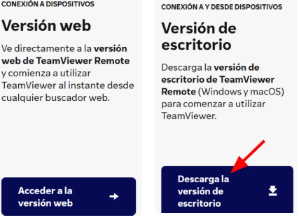

### Descargar Teamviewer

Entramos a la página de TeamViewer y buscamos para descargar, podemos ver que nos sale dos opciones, una que es Descargar TeamViewer y la otra que es Descargar QuickSupport. La que tenemos que descargar es la segunda, “Descargar QuickSupport” ya que es la versión que deja al Usuario recibir asistencia del técnico.

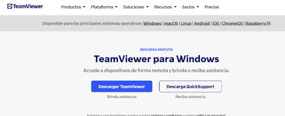

### Ejecución de la versión de QuickSupport

Cuándo lo abrimos nos aparecerá la pestaña siguiente. Donde nos aparece el ID del equipo y la contraseña.

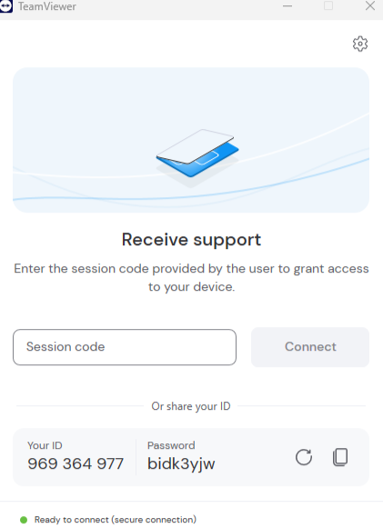

### Maneras de conectarse 

Tenemos dos maneras de conectarnos:

#### Conexión por el ID y la contraseña.

El cliente le da el ID y la contraseña al técnico.

El técnico pone el ID en TeamViewer y seguidamente le pedirá la contraseña.

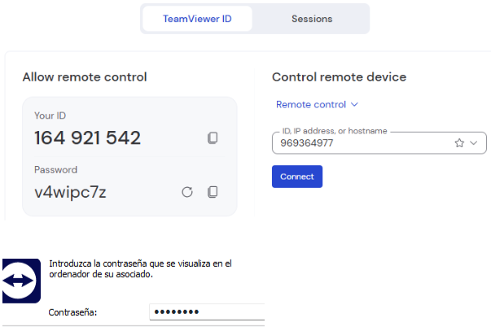

Y como podemos ver, finalmente el técnico accede a la sesión.

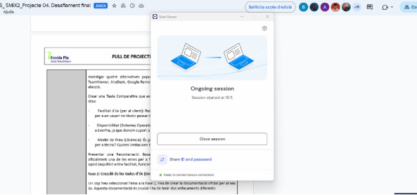

#### Conexión por código o enlace.

El técnico genera un código o enlace de conexión y se lo envía al cliente para que el cliente entre.

El cliente pone el código.

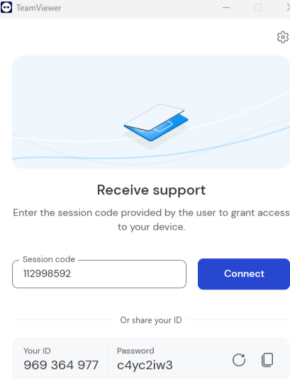

Como todo el cliente acepta la conexión y mira si es el usuario correcto.

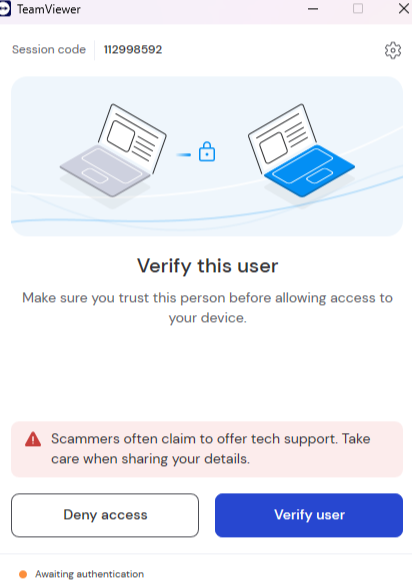

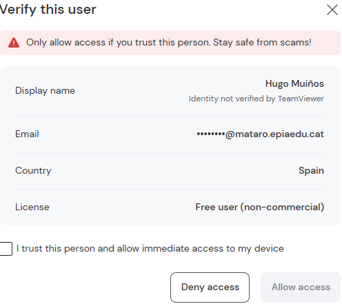

Y por último el técnico accede a la sesión

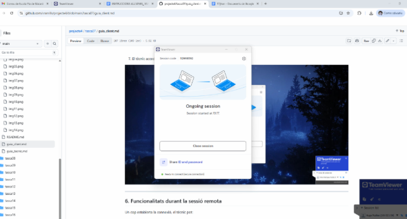

### Funciones durante la sesión remota del técnico al cliente.

Una vez el técnico se haya conectado al cliente el técnico puede hacer cosas como controlar el ratón del cliente, mirar todo lo que pasa en la pantalla del cliente, puede enviar archivos al cliente, puede recibir documentos del cliente, etc. “Estas son algunas de las cosas que el técnico puede hacer en medio de la conexión”.

- **Controlar el ratón y teclado:**

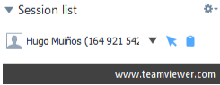

- **Mirar todo lo que pasa en la pantalla del cliente:**

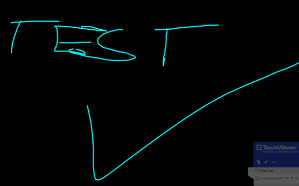

- **Recibir documentos del cliente:**

- **Enviar archivos al usuario:**

### Configuración de Cliente

El cliente puede hacer cosas como permitir el audio y el video, etc.

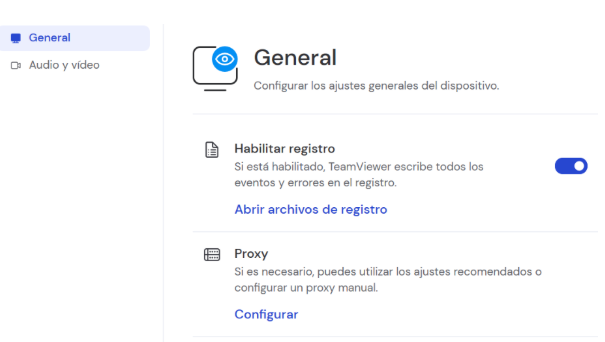

### Cosas a tener en cuenta:

El cliente tiene contraseñas temporales, el técnico no puede conectarse si el cliente no da el permiso, cuándo el soporte o el servicio ya acabó el cliente obviamente puede cerrar TeamViewer tranquilamente y también obviamente el técnico no puede entrar otra vez a no ser que el cliente lo permita n8u7evamnete y le de el código y la contraseña nuevamente,.

[Torna a l'enunciat](README.md)
