# Solució-Tècnic: T07: Accés remot. Serveis d’assistència remota (tasca en parelles)

## Fase 1: Anàlisi Comparativa i Selecció de la Solució
Lo primero que tenemos que hacer es hacer la tabla y decidir qué herramientas utilizaremos.

### Tabla comparativa

| **Criterio**                                      | **TeamViewer**                                                                                                                                      | **AnyDesk**                                  | **Chrome Remote Desktop**                                                                 | **LogMein**                                      |
|----------------------------------------------------|------------------------------------------------------------------------------------------------------------------------------------------------------|----------------------------------------------|-------------------------------------------------------------------------------------------|--------------------------------------------------|
| **Facilidad de uso para el cliente**              | Tenemos que descargar la aplicación o también si es caso de cliente sería el módulo QuickSupport y también el usuario tendrá que darle la contraseña y el ID al técnico. | Tienen que instalarlo, tiene ID fácil.      | Es fácil de utilizar si es que el cliente tiene una cuenta de Google que yo creo que todos tienen. | Se tiene que descargar una aplicación.          |
| **Instalación / Portable**                        | Como he dicho antes tiene la opción de QuickSupport                                                                                                | Tiene una instalación rápida                | No hace falta tenerlo instalado en el escritorio del ordenador                              | Tienen que tener una instalación                |
| **Windows, macOS, Linux, dispositivos móviles**   | Sí tiene todo                                                                                                                                       | Sí tiene todo                               | Sí tiene todo                                                                            | Tiene todo menos Linux                          |
| **¿Permite una versión gratuita para uso comercial?** | No permite                                                                                                                                           | No permite                                  | Sí que permite                                                                            | No permite                                      |
| **Precio**                                        | El técnico sí que tiene que pagar algo o si no alguna suscripción                                                                                   | Tienen que tener algún pago pero es un poco más barato | Si es de Google claro que es gratis                                                       | Se necesita un pago que la verdad que es un poco caro |
| **¿En la versión gratuita, tiene limitaciones?**  | Tiene que cerrar sesión                                                                                                                             | Tiene algunas limitaciones en algunas funciones | Sus funcionalidades que tiene son prácticamente básicas                                     | Este ya ni tiene la versión gratuita           

### Justificación de la herramienta que seleccionaremos

Mi compañero y yo hemos decidido usar TeamViewer ya que prácticamente es fácil de usar y de conectarse, el usuario pasa su ID y su contraseña y el técnico se conecta o también el técnico le pasa al cliente un link y se puede conectar.

## Fase 2: Guia: Manual per al Tècnic (Intern d'EverPia)

Esta guía es solo para técnicos, está bien explicada y con lo necesarios para hacer asistencia remota.

### Instalación del TeamViewer

Primero tenemos que descargarnos la aplicación de TeamViewer ya que sin ella no podemos hacer asistencia remota, para eso nos vamos ala pagina de TeamViewer y nos descargamos la versión que dice “Brinda asistencia”

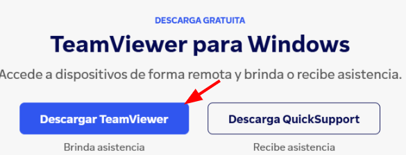

Una vez esté descargada la aplicación, tenemos que hacer el procesos de instalación, lo hacemos siguiendo los pasos que nos indican.

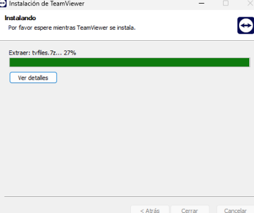

Cuándo acabe la instalación, abrimos la aplicación y veremos que nos pide que aceptemos la licencia de TeamViewer 

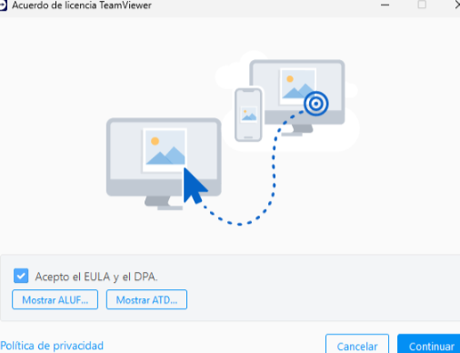

Por supuesto que aceptamos

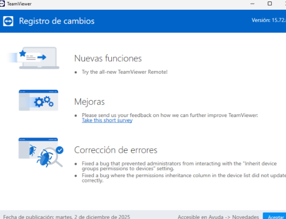

Una vez entremos, vemos que nos aparece el panel principal, y al lado nos sale nuestro ID y nuestra contraseña, pero ojo que eso es por si queremos recibir asistencia remota, como eso no nos interesa, nosotros tenemos que darle a iniciar sesión.

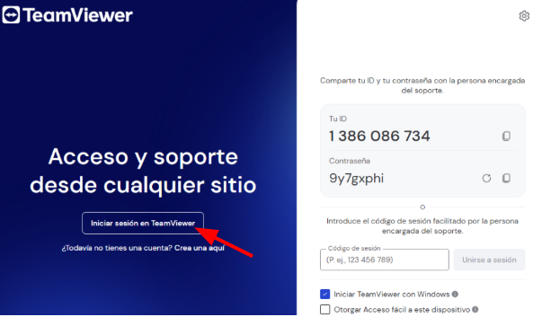

Y lo típico ponemos nuestro nombre y nuestro correo, en este caso ponemos la cuenta del colegio

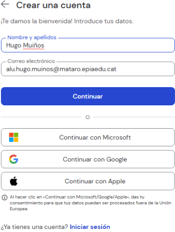

Una vez dentro, como podemos ver, ya podemos dar asistencia remota a nuestros clientes.

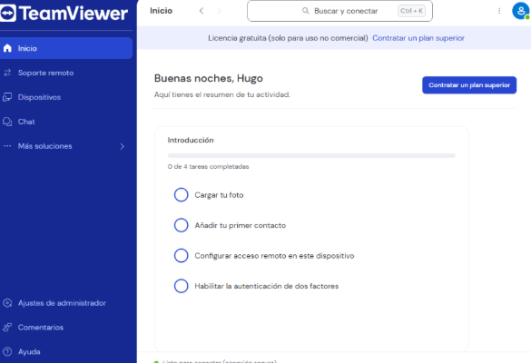

### Proceso de asistencia remota

Para comenzar a dar soporte de asistencia remota, como es de suponerse nuestros clientes también tienen que tener TeamViewer, para eso le decimos que se descarguen la opción que pone “Recibe asistencia” (Descarga QuickSupport)

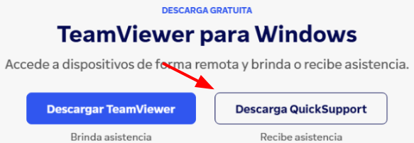

### Conexión remota por ID y contraseña

Cuando el cliente acabe de instalar, nosotros nos vamos a la opción de soporte remoto.

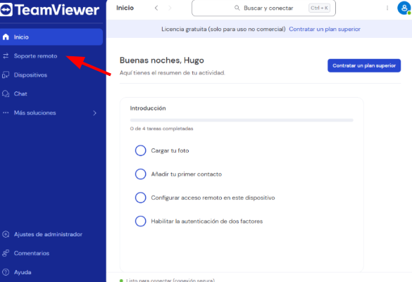

Y vemos que nos sale un espacio para poner el ID del cliente, para eso el cliente nos tiene que pasar su ID y su contraseña que le sale al entrar a la aplicación.

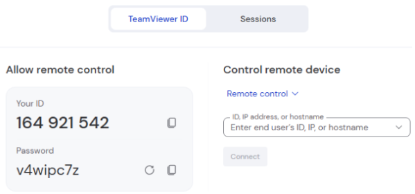

El cliente nos pasa su ID y su contraseña.

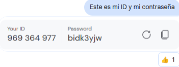

Y nosotros ponemos su ID en el campo que nos lo pide y le damos a conectar.

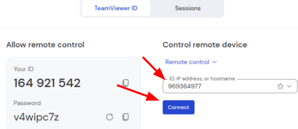

 Después nos pedirá la contraseña que es la que el usuario también nos la ha dado.

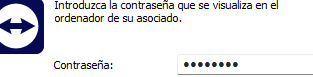

Y como podemos ver ya nos hemos conectado al ordenador del cliente.

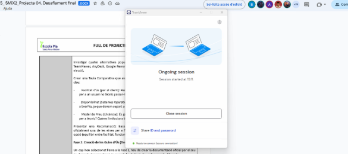

### Conexión remota por inicio de sesión

También hay otra forma de conectarnos al cliente, esa otra forma es a través de sesión, para eso en soporte remoto tenemos que darle a sesiones y a nueva sesión.

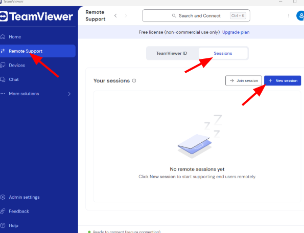

Una vez con la sesión creada el usuario se puede conectar por un enlace, un enlace que el técnico le enviará al cliente. “Le da a copiar el link”

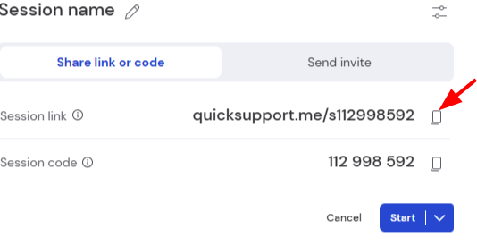

El técnico envia el link al cliente.

El cliente entra al link y pone el código ID que es el que pone /ID y le da conectar.

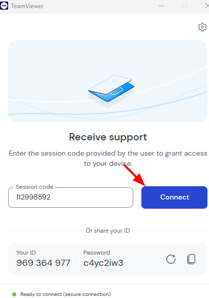

Y como vemos a continuación yo el técnico finalmente me he conectado con el cliente.

### Funciones adicionales

Una vez estemos como soporte de asistencia remota al cliente, podemos hacer algunas cosas. Como transferencia de archivos, reinicio remoto, etc. Eso se hace con los siguientes botones.

### Ver información del sistema del cliente

Unas de las funciones es que podemos ver información sobre el sistema del cliente, eso lo podemos hacer clicando sobre el primer icono, aquí lo que podemos ver es básicamente toda la información del cliente, eso nos puede facilitar un poco para si tenemos que ver algún problema.

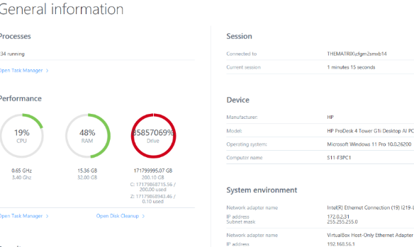

### Enviar secuencia

Con las teclas Ctrl+Alt+Supr que está en el segundo disco podemos enviar la secuencia al en el ordenador del cliente y esto lo que hará es que nos llevará al gestor de tareas.

### Transferencia de archivos

Después también tenemos la función de transferir archivos, esto como bien dice transferencia nos permite enviar como también recibir archivos. Para eso es el tercer icono.

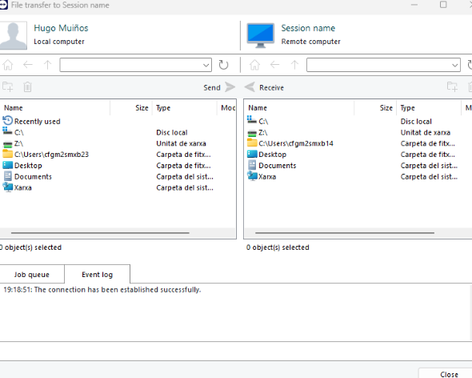

### Reiniciar remotamente 

Con el último icono lo que podemos hacer es que podemos reiniciar el ordenador del cliente de forma remota.

### Función de pisarra

Esta función no permite dibujar sobre la pantalla del cliente, esto por ejemplo para indicarle al cliente alguna cosa.

### Buenas prácticas

Ahora tenemos algunas buenas prácticas de seguridad, esto es para garantizar la seguridad durante la asistencia remota. Algunas buenas prácticas son:

- Asegurarse de que el cliente sepa que vamos a iniciar sesión.
- No darles las credenciales a otras personas.
- Cerrar la sesión de la asistencia remota tal cuál acabemos la asistencia.
- Tener siempre el TeamViewer actualizado.
- Tratar al cliente de la mejor manera.

[Torna a l'enunciat](README.md)

