# Solució: T08: Auditoria de Qualitat i Estandardització de Servidors (tasca individual)
# Auditoria de Qualitat i Estandardització de Servidors (SOP)

A continuació, es detallen les tasques que heu de realitzar per preparar la vostra prova de  certificació.  

## Tasca 1: Desplegament de la Plantilla (OVA) 

Importeu la màquina virtual "Ubuntu Server Base" (el fitxer .ova proporcionat). Assegureu-vos  de marcar l’opció per generar noves adreces MAC en totes les interfícies.  

## Tasca 2: Configuració de Xarxa i Identitat  

Un cop inicieu la màquina, verifiqueu les adreces IP que us proporciona.  

Canvieu a VirtualBox la interfície que està en NAT per “adaptador pont”. Editeu el Netplan amb  la següent configuració: 

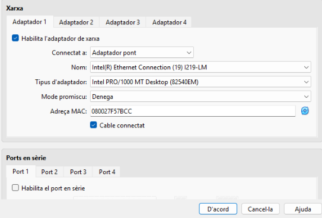

-  Adreça 192.168.C.X on C=2 (A) o 4 (B) i X és el vostre número de llista.
-  Porta d’enllaç 192.168.2.254 o 192.168.4.254 segons correspongui.
-  Servidor de noms: 8.8.8.8  

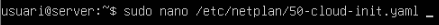

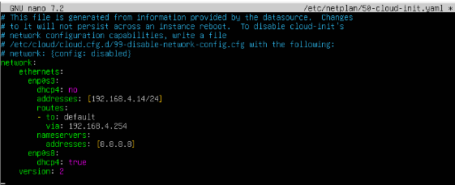

Apliqueu els canvis i verifiqueu les adreces.  

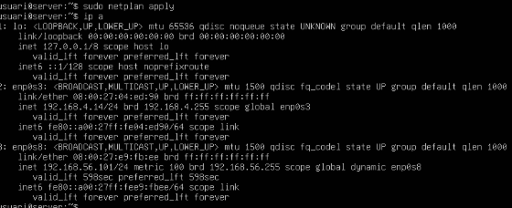

A continuació canviareu el nom del servidor:  

- Canvieu el nom de la màquina a srv-baseXX (on XX és el vostre número).  

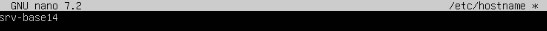

Apliqueu els canvis i verifiqueu que els noms es resolen correctament.  

- Editeu l’arxiu de host perquè el FQDN sigui srv-baseXX.everpia.test 

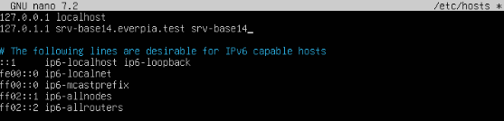

Apliqueu els canvis i verifiqueu que els noms es resolen correctament.  

Reiniciamos la máquina:

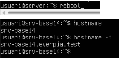

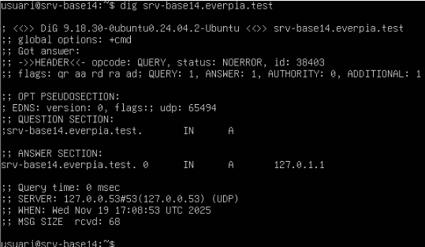

## Tasca 3: Cicle de Vida i Seguretat (Actualitzacions) 

Un servidor no actualitzat és un servidor vulnerable.  

1.Executeu una actualització completa del sistema (repositoris i paquets).  

2.Verifiqueu que no queden actualitzacions pendents. 

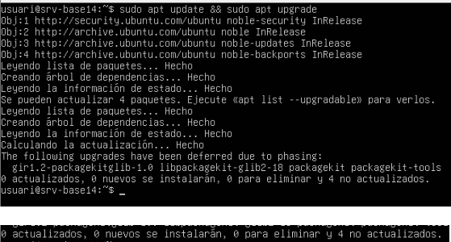

## Tasca 4: Gestió d'Aplicacions (Paquets)  

Sovint necessitem eines addicionals o hem d'eliminar programari innecessari.  

1.Instal·lació: Instal·leu el paquet tree (una eina útil per visualitzar directoris). 

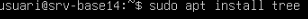

2.Verificació: Executeu tree --version per demostrar que s'ha instal·lat.  

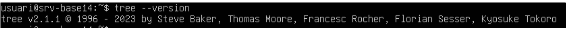

3.Eliminació: Suposem que el paquet vim no està permès per la política de seguretat d'EverPia  (només es permet nano). Desinstal·leu completament el paquet vim (incloent la seva configuració). Elimineu dependències innecessàries amb apt autoremove.  

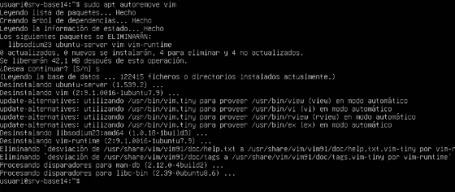

## Tasca 5: Gestió d'Usuaris i Grups  

**Grups:** Creeu dos grups: developers i designers.  

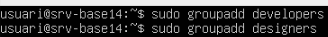

**Usuaris:**

- Creeu un usuari ana_dev i afegiu-lo al grup developers.  

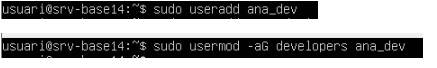

- Creeu un usuari marc_design i afegiu-lo al grup designers.  

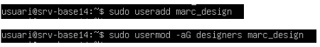

Verificació: Mostreu el contingut de l'arxiu /etc/group (utilitzant grep) on es vegin els nous grups i  els usuaris assignats.  

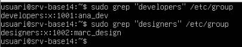

## Tasca 6: Gestió de Permisos i Propietat 

Aquesta és la tasca més crítica. Hem de crear l'estructura de carpetes del projecte i assignar els  permisos correctes per evitar que els departaments es molestin entre ells.  

**Creació d'Estructura:**

- Creeu un directori arrel: /srv/projectes  

- Creeu dos subdirectoris: /srv/projectes/dev_area i /srv/projectes/design_area.  

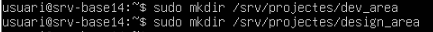

**Assignació de Propietat (Ownership):**

- La carpeta dev_area ha de pertànyer a root i al grup developers.  

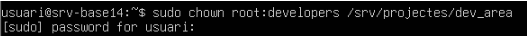

- La carpeta design_area ha de pertànyer a root i al grup designers.  

**Assignació de Permisos:**

-  El propietari (root) ha de tenir control total (rwx) sobre les carpetes.  

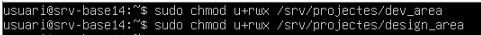

- El grup propietari de cada carpeta (developers, designers) ha de poder crear i modificar fitxers  dins la seva carpeta (rwx).  

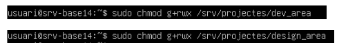

- Verificar els permisos amb la comanda ls -l 

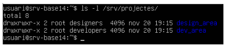

- Important: Els usuaris d'un grup NO han de poder veure el contingut ni accedir a la carpeta de  l'altre grup. (Permisos 770).

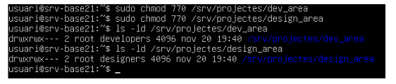

## Proves: 

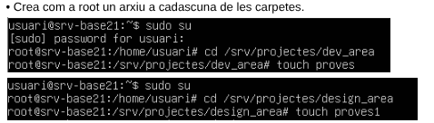

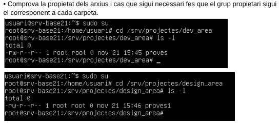

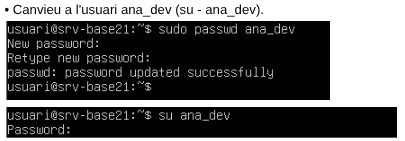

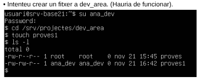

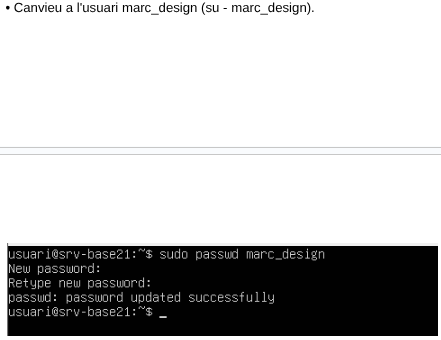

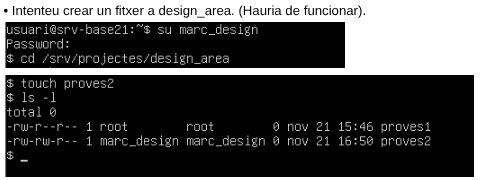

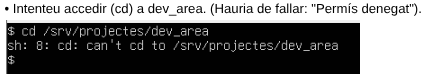

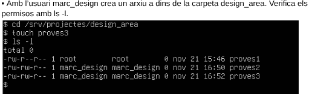

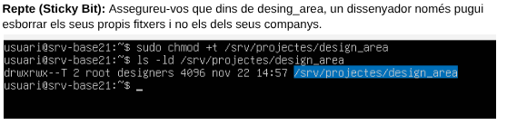

[Torna a l'enunciat](README.md)

