# Solució: T09: Servidor fitxers Linux. NFS (tasca individual)

## Fase 1: Preparació de l'entorn

### Per preparar aquesta prova de concepte, necessitaràs dues màquines virtuals Linux: tot i que pel servidor podríem fer servir qualsevol distribució, ens decantarem per Ubuntu Server 24.04 LTS per la seva facilitat d'ús i popularitat. Per al client, utilitzarem Zorin OS 18. Els dos equips els configurarem amb dues interfícies de xarxa: una NAT per a l'accés a Internet i una adaptador de xarxa només-amb-amfitrió per a la comunicació entre ells i potencialment, treballar via terminal SSH amb el servidor.

**Ubuntu Server:**

Creamos la máquina


Nos vamos a configuraciones y en red ponemos el primer adaptador en “NAT” para tener conexión a internet.


Habilitamos el segundo adaptador y ponemos en “Adaptador de solo anfitrión” para que las máquinas se puedan conectar entre ellas.


**Zorin Cliente:**

Lo mismo creamos la máquina


Una vez creada la máquina, nos vamos a configuraciones y en red, en el adaptador 1 ponemos “NAT” para que la máquina tenga conexión a internet.


Después habilitamos el segundo adaptador y lo ponemos en “Adaptador de solo anfitrión” para que se pueda conectar con la otra máquina del server.


### Tots dos equips els instal·larem seguint els requisits recomanats. L'idioma triat serà espanyol (Espanya) i amb l'idioma per defecte en espanyol. En el cas d'Ubuntu Server, seleccionarem la instal·lació del servei SSH durant el procés d'instal·lació per facilitar la gestió remota.

**Ubuntu Server:**

Le damos a iniciar la máquina y ahora sí toca hacer la instalación, tal y como nos lo pide la tasca, seleccionamos el idioma que será “Español” de España.


Nos dice que el idioma por defecto del teclado también es “Español” de España.


Tal y como nos pide la tasca durante el proceso de instalación instalaremos el SSH.


**Zorin Cliente:**

Hacemos lo mismo con el Zorin del cliente, iniciamos la máquina y hacemos el proceso de instalación, seleccionamos el idioma, el cuál será “Español de España” y le damos a Instalar Zorin OS.


Lo mismo con el teclado, seleccionamos “Español” de España y continuamos.


### Ens assegurarem que ambdues màquines tinguin accés a Internet i que es puguin comunicar entre elles a través de la xarxa només-amb-amfitrió i actualitzarem els sistemes amb les últimes actualitzacions disponibles.

**Ubuntu server:**

Para asegurarnos de que la máquina del servidor en este caso Ubuntu Server tenga conexión a internet hacemos un ping a google. 

``` bash
ping google.com
```


Para comprobar que las dos máquinas puedan comunicarse entre ellas, desde la máquina del cliente que en este caso es la máquina Zorin hacemos ip a para ver la ip del adaptador de solo anfitrión para que después nos conectemos con esa ip desde la máquina Ubuntu del servidor.

``` bash
ip a
```

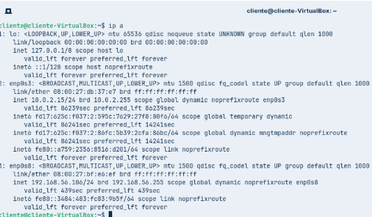

Después de hacer ip a en la máquina Zorin del cliente, desde la máquina Ubuntu que es del servidor hacemos un ping a esa ip del adaptador de solo anfitrión de la máquina del cliente.

``` bash
ping 192.168.56.106
```

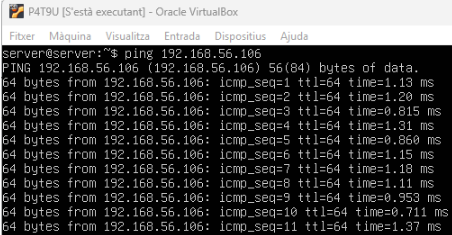

Por último actualizamos el sistema.

``` bash
sudo apt apgrade && sudo apt update
```


**Zorin Cliente:**

Lo mismo con el Zorin del cliente, para asegurarnos de que tenemos conexión a internet hacemos un ping a google.

``` bash
ping google.com
```

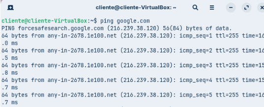

Después hacemos ip a desde la máquina Ubuntu para ver la ip del adaptador de solo anfitrión para que con esa ip hagamos un ping desde la máquina Zorin a la máquina Ubuntu.

``` bash
ip a
```

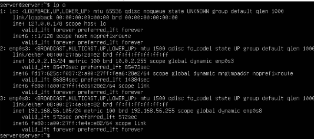

Ahora desde la máquina Zorin del cliente hacemos un ping a esa ip del adaptador de solo anfitrión de la máquina Ubuntu.

``` bash
ping 192.168.56.105
```

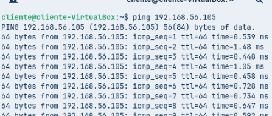

Y por último actualizamos el sistema.

``` bash
sudo apt apgrade && sudo apt update
```

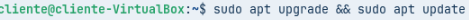

## Fase 2: Preparació del servidor

### Abans de compartir res, hem de preparar els usuaris i els directoris al Servidor.

- **1.Creació de Grups: Crear dos grups per al client: devs i admins.**

Para crear los grupos hacemos las siguientes comandas:

``` bash
sudo groupadd devs
sudo groupadd admins
```

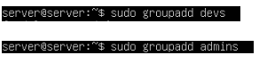

Después de crear los dos grupos hacemos las siguientes comandas para comprobar que se han creado bien.

``` bash
grep devs /etc/group
grep admins /etc/group
```

En lo que vemos que se han creado correctamente.

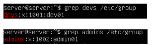

- **2.Creació d'Usuaris: Crear un usuari dev01 (membre del grup devs).**

Hacemos la siguiente comanda para crear los usuario, que se creen con la carpeta personal y para hacerlo miembro del grupo que nos pide. 

``` bash
sudo useradd -G devs -m -s /bin/bash dev01
```


Después hacemos la comanda que se muestra a continuación para confirmar que lo hemos hecho bien.

``` bash
grep dev01 /etc/passwd
```

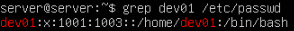

- **3.Crear un usuari admin01 (membre del grup admins).** 

Hacemos la siguiente comanda para crear los usuario, que se creen con la carpeta personal y para hacerlo miembro del grupo que nos pide. 

``` bash
sudo useradd -G admins -m -s /bin/bash admin01
```


Después hacemos la comanda que se muestra a continuación para confirmar que lo hemos hecho bien.

``` bash
grep admin01 /etc/passwd
```

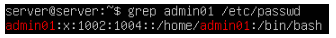

**Creació de Directoris (al Servidor):**

- **4.Crear el directori per als projectes de desenvolupament: /srv/nfs/dev_projects**

Para crear el directorio para los proyectos hacemos la siguiente comanda.

``` bash
sudo mkdir /srv/nfs/dev_projects
```


- **5.Crear el directori per a les eines d'administració: /srv/nfs/admin_tools**

Para crear el directorio para las herramientas de administración hacemos casi el mismo comando solo que al final cambiamos el nombre.

``` bash
sudo mkdir /srv/nfs/admin_tools
```


Como podemos ver, hacemos la comanda ls /srv/nfs y dentro nos salen los dos directorios creados anteriormente.

``` bash
ls /srv/nfs
```

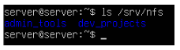

- **6.Permisos del Servidor (El punt clau):**

**Es vol que els developers tinguin control total sobre els seus projectes.**

Hacemos la siguiente comanda para que developers tengan el control total sobre sus proyectos.

``` bash
sudo chown root:devs /srv/nfs/dev_projects
```


**Es vol que els administradors tinguin control sobre les seves eines.**

Hacemos la siguiente comanda para que administradors tengan el control total sobre sus herramientas.

``` bash
sudo chown root:admins /srv/nfs/admin_tools
```


**En tots dos casos, l'usuari propietari serà root.**

En las capturas anteriores se ve como root es el propietario.

También le asignamos los permisos a las carpetas:

``` bash
sudo chmod 2775 /srv/nfs/dev_projects
sudo chmod 2775 /srv/nfs/admin_tools
```

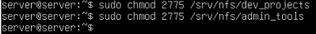

Y hacemos la comanda ls -l para comprobar que los permisos son los correctos

``` bash
ls -l /srv/nfs
```

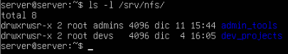

Después antes de hacer el siguiente punto tenemos que crear los grupos y los usuarios que tengan el mismo ID en la máquina cliente osea en Zorin.

Instalamos la aplicación users and groups para crear los grupos y los usuarios.

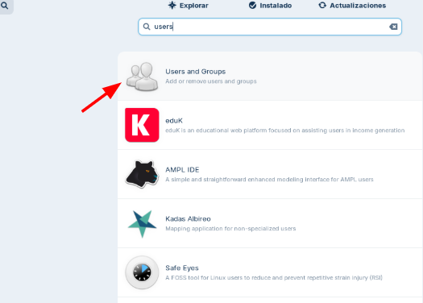

Miramos que los usuarios y grupos estén todos bien “contraseña de los usuarios en zorin es usuari”

Hacemos la siguiente comanda para ver que tengamos el mismo ID y que se hayan creado bien los usuarios.

``` bash
cat /etc/group
```


``` bash
sudo grep dev01 /etc/passwd
sudo grep admin01 /etc/passwd
```

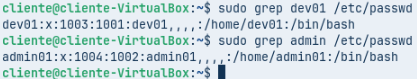

Y lo mismo, hacemos la siguiente comanda para ver que los grupos estén bien y hayamos asignados bien a los usuarios al grupo que corresponde.

``` bash
sudo grep devs /etc/group
sudo grep admins /etc/group
```

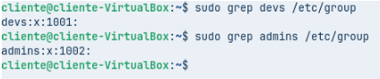

- **7.Com a pas final, s'instal·laran els paquets necessaris per al servei NFS al servidor i es configurarà l'exportació dels directoris amb les opcions adequades.**

Para instalar los paquetes necesarios para el servicio NFS hacemos la siguiente comanda.

``` bash
sudo apt install nfs-kernel-server -y
```


Comprobamos que se haya instalado bien y que esté activo.

``` bash
sudo systemctl status nfs-kernel-server
```

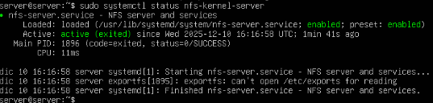

Una vez vemos que está activo, tenemos que editar el archivo /etc/exports para decir que archivos queremos exportar, que en este caso vamos a exportar el archivo /srv/nfs 

``` bash
sudo nano /etc/exports
```

Añadimos la línea que está al final.

``` bash
/srv/nfs *(rw,sync,no_subtree_check)
```

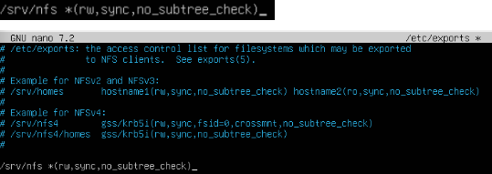

Después tenemos que reiniciar el servicio para poder aplicar los cambios.

``` bash
sudo systemctl restart nfs-kernel-server
```


Una vez reiniciado el servicio lo que tenemos que hacer es comprobar que todo funciona bien y correctamente, para eso en la máquina Ubuntu del server hacemos la siguiente comanda para ver qué archivos son los que podemos exportar.

``` bash
sudo exportfs -u
```

Y como podemos ver nos dice que archivos son los que podemos exportar en este caso está todo bien ya que coincide con la línea añadida en el archivo /etc/exports.

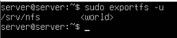

Después hacemos ip a para ver la ip del adaptador de solo anfitrión.

``` bash
ip a
```

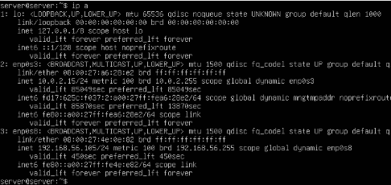

Para que con esa ip probemos de hacer la siguiente comanda para ver el puerto desde el cuál trabaja.

``` bash
sudo rpcinfo -p 192.168.56.105
```

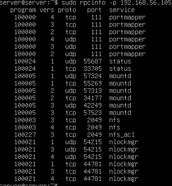

Como podemos ver, en este caso trabaja desde el puerto 2049.

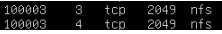

Después nos conectamos desde el cliente que es Zorin a la máquina del servidor que es Ubuntu, pero para eso primero tenemos que instalar el paquete nfs-common. 

``` bash
sudo apt install nf-common
```

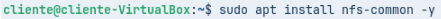

Ahora sí después nos conectamos desde el cliente que es Zorin a la máquina del servidor que es Ubuntu con la ip del adaptador de solo anfitrión de la máquina del server que es Ubuntu.

``` bash
sudo showmount -e 192.168.56.105
```

En la cuál una vez conectado vemos ,la carpeta /srv/nfs que es lo que podemos exportar.

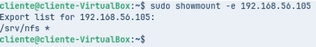

## Fase 3: L'Exportació d'Administració (El Dilema del root_squash)

### El client necessita que el directori /srv/nfs/admin_tools sigui accessible per l'equip d'administradors. A vegades, l'usuari root del client (que sou vosaltres, els consultors) necessitarà escriure en aquest directori per instal·lar eines. Aquí mostrarem un error típic i la seva solució.

- **Prova 1 (L'error comú)**

**Exportar el directori /srv/nfs/admin_tools amb les opcions 'rw,sync'.**

Como hemos visto anteriormente ya exportamos el archivo /srv/ns/ en el archivo exports


**Des del client, muntar aquest recurs compartit a /mnt/admin_tools. Com a root del client, intentar crear un fitxer dins d'aquest directori muntat.**

Primeramente creamos la carpeta ya que seguramente no exista.

``` bash
sudo mkdir /mnt/admin_tools
```


Después de crear la carpeta lo que tenemos que hacer es montar los recursos para eso utilizaremos la siguiente comanda.

``` bash
sudo mount -t nfs 192.168.56.105:/srv/nfs/admin_tools /mnt/admin_tools
```

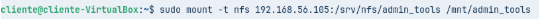

Una vez montado intentaremos crear un archivo dentro de esta carpeta, yo lo haré desde los archivos de la máquina para eso nos vamos a archivos y localizamos la carpeta de “mnt” y entramos.

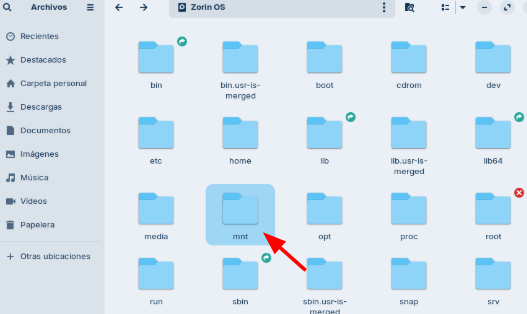

Una vez dentro de la carpeta, intentamos entrar a la carpeta “admin_tools” y vemos que nos pide autenticación, ponemos la contraseña del usuario de la máquina.

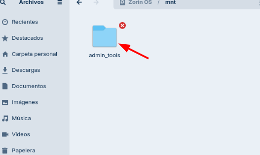

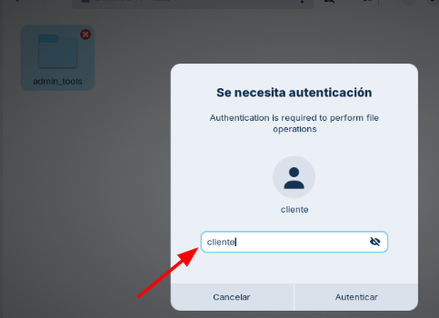

Una vez dentro si intentamos crear un archivo vemos que no nos deja, ya que no tenemos los permisos.

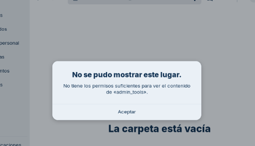

**Verificar quin és el propietari del fitxer creat. Per què? Justificar la resposta amb l'explicació tècnica de 'root_squash'.**

No nos deja entrar a la carpeta ya que no tenemos los permisos, eso nos pasa por que no tenemos el root_squash, lo cuál causa que el usuario de la máquina cliente no es el mismo root que el de la máquina server que es Ubuntu. “Pero veremos como en la siguiente actividad “Prueba 2 (La Solución)”lo solucionamos”

Mientras que vemos que si con el usuario admin si podemos crear, eso pasa ya que el usuario admin si tiene los permisos necesarios en esta carpeta. Para eso hacemos lo siguiente:

``` bash
sudo login admin01
```

Nos ponemos con usuario admin e intentamos crear un archivo y vemos que sí que podemos, además también hacemos un ls + la ruta de carpeta para ver que se ha creado.

``` bash
touch /mnt/admin_tools/file01
ls /mnt/admin_tools
```

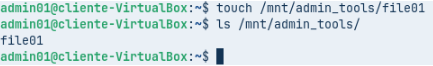

Como podemos ver el propietario es el usuario admin01.

``` bash
cd /home/cliente
ls -l /mnt/admin_tools
```

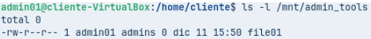

Y vemos como ahora en la siguiente prueba vemos como podemos solucionar para que ahora sí el usuario root pueda crear archivos.

- **Prova 2 (La Solució)**

**Modificar l'exportació del directori /srv/nfs/admin_tools per incloure l'opció 'no_root_squash'.**

Para comenzar tenemos que editar el archivo /etc/exports.

``` bash
sudo nano /etc/exports
```

En el que editamos la linea anterior para incluir la opción de “no_root_squash” y además añadimos la segunda línea 

``` bash
/srv/nfs/admin_tools *(rw,sync,no_subtree_check,no_root_squash)
/srv/nfs/dev_projects *(rw,sync,no_subtree_check)
```

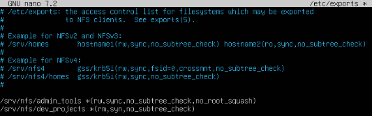

Como podemos ver en la imágen anterior, la segunda línea, me he equivocado y he puesto “rm” en cuenta de “rw” y también he puesto “syn” en cuenta de “sunc”. (ERROR MÍO) pero lo correcto sería como se muestra en el comando de antes de la imágen, pero que también lo pongo a continuación. LO CORRECTO SERÍA:

``` bash
/srv/nfs/admin_tools *(rw,sync,no_subtree_check,no_root_squash)
/srv/nfs/dev_projects *(rw,sync,no_subtree_check)
```

Una vez hecho eso, lo que tenemos que hacer es reiniciar el servicio para que se apliquen los cambios. 

``` bash
sudo systemctl restart nfs-kernel-server
```


**Al client, desmuntar i tornar a muntar el recurs compartit.**

Ahora nos dice que tenemos que desmontar y volver a montar nuevamente los recursos compartidos, para eso hacemos las siguientes comandas.

Para desmontar:

``` bash
sudo umount /mnt/admin_tools
```


Para montar la ip que ponemos es la ip del adaptador de solo anfitrión de la máquina del Ubuntu que es el servidor.

``` bash
sudo mount 192.168.56.105:/srv/nfs/admin_tools /mnt/admin_tools
```


Aquí vemos las dos comandas juntas, la primera es para desmontar y la segunda para montar.

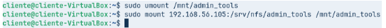

**Com a root del client, intentar crear un fitxer dins d'aquest directori muntat. Observeu quin és el propietari del fitxer creat aquesta vegada. Ha canviat alguna cosa? Justificar la resposta amb l'explicació tècnica de 'no_root_squash'.**

Ahora si intentamos crear un archivo como root, como el anterior archivo era file01 ahora en este caso será file02. Para eso entramos a root y creamos como root el file02


``` bash
sudo su root
touch /mnt/admin_tools/file02
```


Ahora hacemos ls + la ruta de la carpeta para ver que se haya creado bien.

``` bash
ls /mnt/admin_tools
```

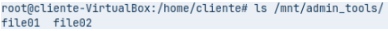

Por último hacemos la comanda ls -l + la ruta de la carpeta y vemos que el propietario del archivo “file02” es root.

``` bash
ls -l /mnt/admin_tools
```

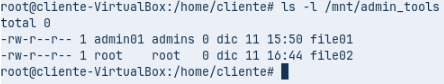

Ahor si que podemos crear un archivo con root, ha cambiado ya que como pueden ver hemos editado el archivo /etc/exports, lo que hemos editado es que el root de las dos máquinas sea el mismo, tanto en la del server que es Ubuntu y la del cliente que es Zorin.

## Fase 4: L'Exportació de Desenvolupament (Permisos rw vs ro)

**Editar /etc/exports per afegir dues exportacions per al mateix directori. El client vol que la xarxa d'administració (p.ex., 192.168.56.0/24) hi pugui escriure, però que la xarxa de consultors (simularem que és una altra IP, p.ex., 192.168.56.100) només pugui llegir.**

Nos pide que la red de administración pueda escribir pero que la red de consultores solo tiene que poder leer.

Para eso nuevamente tenemos que editar el archivo /etc/exports 

``` bash
sudo nano /etc/exports
```

Borramos la segunda línea que había antes y ponemos otras dos, al final como tiene que quedar el archivo /etc/exports es con las tres líneas que se muestran a continuación. Eso lo hacemos para que le asignemos los permisos depende de la ip que tenga el usuario.

``` bash
/srv/nfs/admin_tools *(rw,sync,no_subtree_check,no_root_squash)
/srv/nfs/dev_projects 192.168.56.0/24(rw,sync,no_subtree_check)
/srv/nfs/dev_projects 192.168.56.140(ro,sync,no_subtree_check)
```

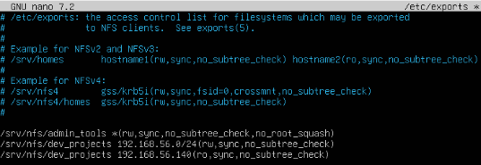

Después como ya sabemos para que se apliquen los cambios reiniciamos el servicio.

``` bash
sudo systemctl restart nfs-kernel-server
```


**Des del client, muntar el recurs compartit a /mnt/dev_projects i provar d'escriure-hi com a usuari dev01. Hauria de funcionar.**

Ahora lo que tenemos que hacer es montar el disco de dev_projects para comprobar que el funcionamiento es el adecuado.

Para eso primeramente creamos la carpeta.

``` bash
sudo mkdir /mnt/dev_projects
```


Ahora modificamos la ip, para eso nos vamos a la configuración, entramos a red y editamos el Ethernet (enp0s8)

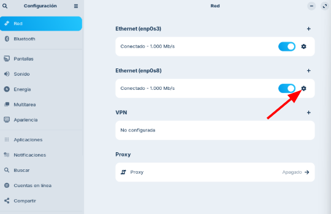

Por ejemplo podemos probar con la siguiente ip y la siguiente máscara que se muestra en la imágen.

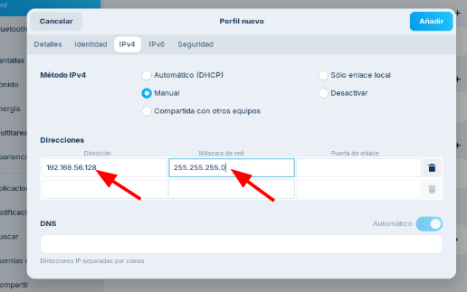

Aplicamos y guardamos los cambios, después montamos los recursos, ojo lo montamos con la carpeta /mnt/dev_projects.

``` bash
sudo mount 192.168.56.105:/srv/nfs/dev_projects /mnt/dev_projects
```

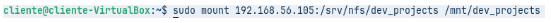

Después de montarlo, entramos como dev01 osea hacemos login y como le hemos puesto la ip del mismo rango, en teoría tiene que dejarnos crear archivos.

``` bash
sudo login dev01
```

Nos metemos en la carpeta con cd

``` bash
cd /mnt/dev_projects
```

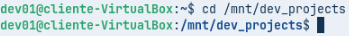

Y como podemos ver a continuación creamos el archivo de ejemplo que se llama “file04” y después hacemos ls y si que nos sale por tanto está bien.

``` bash
touch file04
ls
```

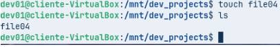

**Desmuntar el recurs i canviar manualment la IP del client a 192.168.56.100. Tornar a provar d'escriure al directori muntat com a usuari dev01 i comprovar que només funciona la lectura.**

Para eso otra vez nos vamos a la configuración, entramos en red y en Ethernet enp0s8 y editamos la ip y la máscara y ponemos una dentro del rango que nos pide el enunciado.

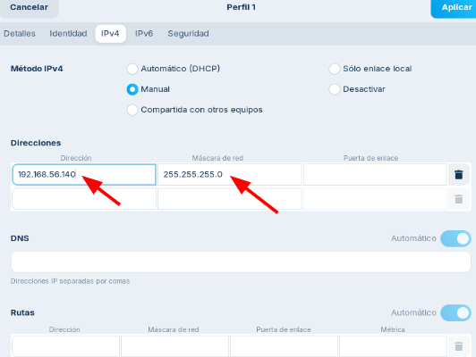

Aplicamos y guardamos los cambios, entramos como root. 

``` bash
sudo su root
```

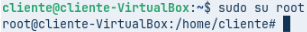

Entramos a la carpeta y vemos que sí que nos deja entrar a la carpeta y ver el contenido que hay dentro.

``` bash
cd /mnt/dev_projects
ls
```


Intentamos crear un archivo que en este caso será el file05 y vemos que nos dice que solo tenemos permisos de lectura por tanto está bien.

``` bash
touch file05
```

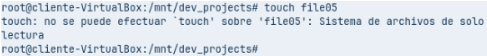

Aquí vemos todo el procedimiento junto en una sola captura.

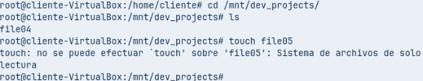

**Canvieu d'usuari al client a admin01 i torneu a provar d'escriure al directori muntat. Comproveu que no es pot escriure, ja que admin01 no és membre del grup devs (permisos locals del sistema de fitxers).**

Hacemos login con admin01 e intentamos crear un archivo dentro de la carpeta y nos dice que no podemos escribir, por tanto está bien.

``` bash
touch /mnt/dev_projects/file06
```

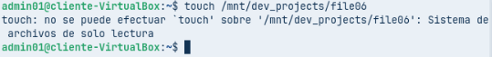

## Fase 5: Muntatge Automàtic amb /etc/fstab

### És evident que els usuaris no poden estar muntant manualment els recursos compartits cada vegada que reinicien el sistema. Per això, es configurarà el muntatge automàtic mitjançant el fitxer /etc/fstab al client.

**Editar el fitxer /etc/fstab al client per afegir les entrades necessàries per muntar automàticament els recursos compartits NFS al directori /mnt/admin_tools i /mnt/dev_projects durant l'inici del sistema.**

Primero tenemos que entrar al archivo /etc/fstab

``` bash
sudo nano /etc/fstab
```

Una vez dentro, abajo del todo añadimos las dos últimas líneas que muestro a continuación.

``` bash
192.168.56.105:/srv/nfs/admin_tools /mnt/admin_tools nfs defaults 0 0
192.168.56.105:/srv/nfs/dev_projects /mnt/dev_projects nfs defaults 0 0
```

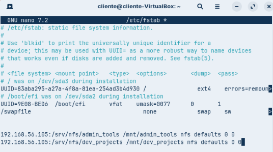

**Executar la comanda mount -a per provar les entrades sense reiniciar.**

Después seguidamente hacemos la comanda mount -a para que se apliquen los cambios y se vuelva a montar todo, o si no también podemos reiniciar la máquina y ya.

``` bash
mount -a
"O reinciar la máquina"
```

**Reiniciar el client i verificar que els recursos compartits s'han muntat correctament.**

Como ya hemos reiniciado la máquina en el punto anterior, ahora lo que tenemos que hacer es comprobar que los recursos compartidos se han montado correctamente.

Para eso entramos como root.

``` bash
sudo su root
```

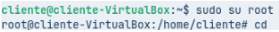

Hacemos cd para entrar a “media”

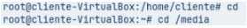

Una vez dentro de media, hacemos la comanda ls -l + ruta, que en este caso será ls -l /mnt/ y nos tendría que salir los dos recursos montados que son admin_tools y dev_projects y como podemos ver esta bien.

``` bash
ls -l /mnt/
```

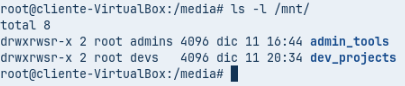

En la siguiente imágen vemos todo el procedimiento junto para que lo entiendan mejor.


## Conclusió

Como hemos visto hemos realizado esta práctica con el NFS y hemos visto que el NFS va bien para compartir los recursos que es su principal función, hemos visto que hemos compartido recursos desde el servidor que en este caso fue Ubuntu hacia el cliente que en este caso fue Zorin, como hemos visto permite hacer una gestión de acuerdo a los usuarios, a los grupos y hasta incluso de acuerdo a la red. Pero no todo es como lo dicen también puede llegar a tener algunos problemas por ejemplo tenemos que crear los mismos usuarios y los mimos grupos en las dos màquinas, en el servidor y en el cliente y que tengan los mismo UID u todo, esto en un entorno real de una empresa física no es muy escalable ya que si tiene muchos equipos o ordenadores tendríamos que hacer lo mismo en todos imaginate si tiene 50 o 100 ordenadores,m tenemos que hacer lo mismo en todos los ordenadores y también el el servidor. 

[Torna a l'enunciat](README.md)

