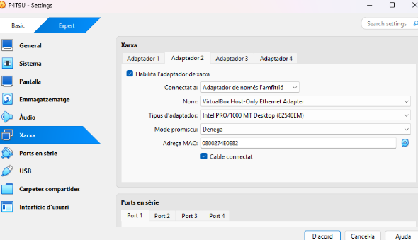
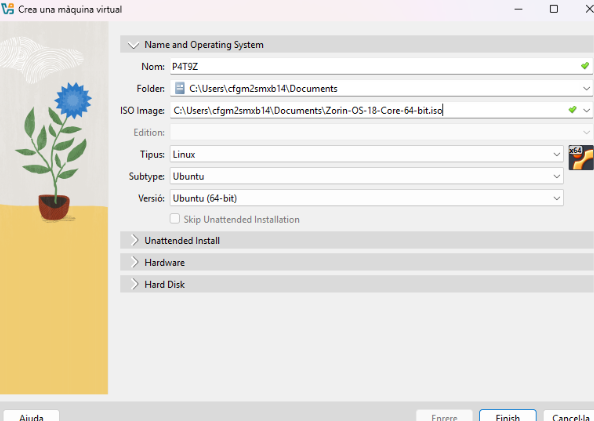
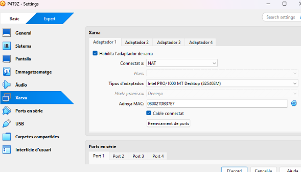
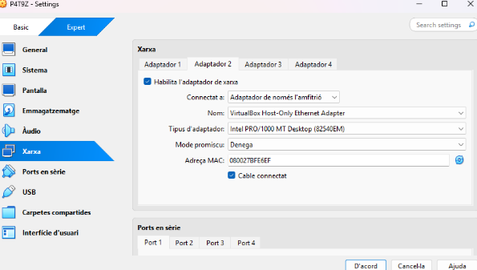
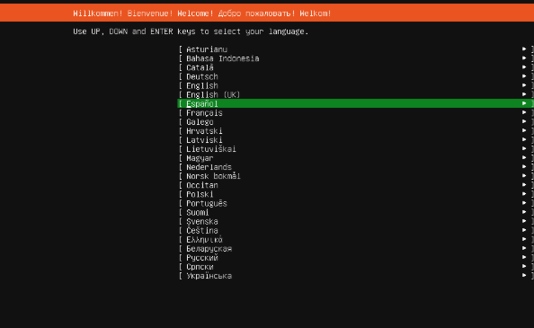
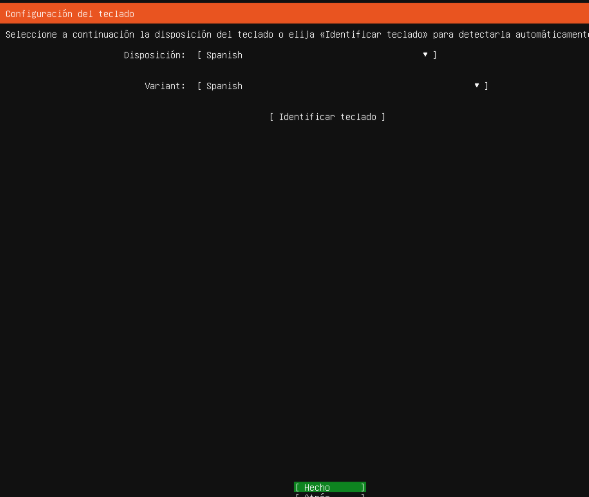
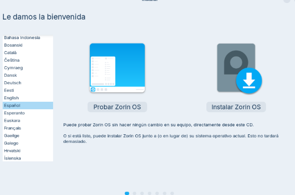
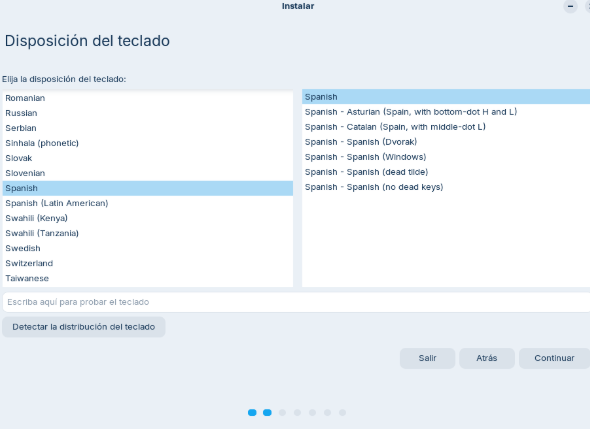

# Solució: T09: Servidor fitxers Linux. NFS (tasca individual)

## Fase 1: Preparació de l'entorn

### Per preparar aquesta prova de concepte, necessitaràs dues màquines virtuals Linux: tot i que pel servidor podríem fer servir qualsevol distribució, ens decantarem per Ubuntu Server 24.04 LTS per la seva facilitat d'ús i popularitat. Per al client, utilitzarem Zorin OS 18. Els dos equips els configurarem amb dues interfícies de xarxa: una NAT per a l'accés a Internet i una adaptador de xarxa només-amb-amfitrió per a la comunicació entre ells i potencialment, treballar via terminal SSH amb el servidor.

**Ubuntu Server:**

Creamos la máquina

Nos vamos a configuraciones y en red ponemos el primer adaptador en “NAT” para tener conexión a internet.

Habilitamos el segundo adaptador y ponemos en “Adaptador de solo anfitrión” para que las máquinas se puedan conectar entre ellas.

**Zorin Cliente:**

Lo mismo creamos la máquina

Una vez creada la máquina, nos vamos a configuraciones y en red, en el adaptador 1 ponemos “NAT” para que la máquina tenga conexión a internet.

Después habilitamos el segundo adaptador y lo ponemos en “Adaptador de solo anfitrión” para que se pueda conectar con la otra máquina del server.

### Tots dos equips els instal·larem seguint els requisits recomanats. L'idioma triat serà espanyol (Espanya) i amb l'idioma per defecte en espanyol. En el cas d'Ubuntu Server, seleccionarem la instal·lació del servei SSH durant el procés d'instal·lació per facilitar la gestió remota.

**Ubuntu Server:**

Le damos a iniciar la máquina y ahora sí toca hacer la instalación, tal y como nos lo pide la tasca, seleccionamos el idioma que será “Español” de España.

Nos dice que el idioma por defecto del teclado también es “Español” de España.

Tal y como nos pide la tasca durante el proceso de instalación instalaremos el SSH.

**Zorin Cliente:**

Hacemos lo mismo con el Zorin del cliente, iniciamos la máquina y hacemos el proceso de instalación, seleccionamos el idioma, el cuál será “Español de España” y le damos a Instalar Zorin OS.

Lo mismo con el teclado, seleccionamos “Español” de España y continuamos.

### Ens assegurarem que ambdues màquines tinguin accés a Internet i que es puguin comunicar entre elles a través de la xarxa només-amb-amfitrió i actualitzarem els sistemes amb les últimes actualitzacions disponibles.

**Ubuntu server:**

Para asegurarnos de que la máquina del servidor en este caso Ubuntu Server tenga conexión a internet hacemos un ping a google. 

